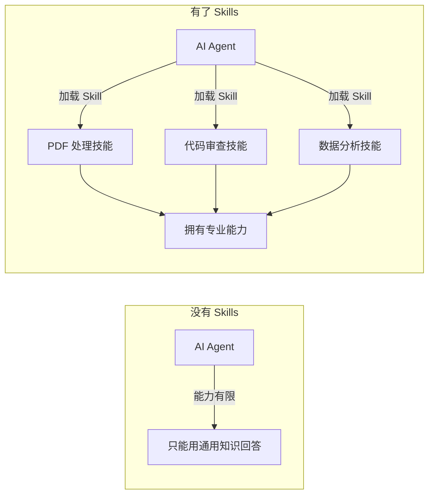
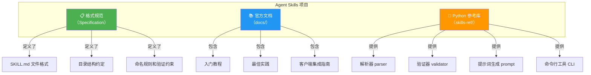
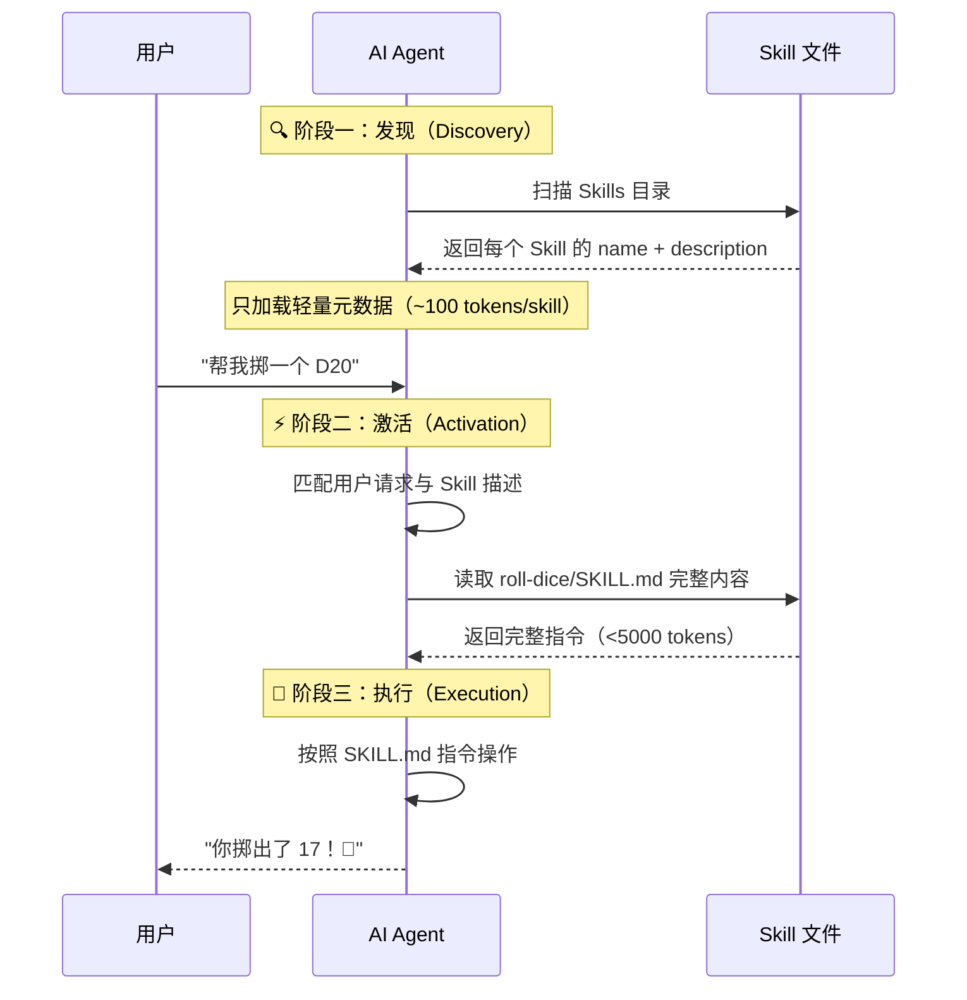

# 第一章：认识 Agent Skills

> 本章将带你了解 Agent Skills 是什么、它解决了什么问题，以及整个项目的架构全貌。

## 1.1 什么是 Agent Skills？

**Agent Skills**（Agent 技能）是一个**开放格式规范**，用于为 AI Agent（如 GitHub Copilot、Claude Code、OpenAI Codex 等）赋予新的能力和专业知识。

简单来说：**Skill 就是一个文件夹**，里面包含一个 `SKILL.md` 文件，告诉 AI Agent 如何完成某个特定任务。

```
my-skill/
├── SKILL.md          # 必需：元数据 + 指令
├── scripts/          # 可选：可执行脚本
├── references/       # 可选：参考文档
└── assets/           # 可选：模板、资源
```

### 一个直观的类比

你可以把 Agent Skills 理解为**AI 世界的"插件系统"**：

| 类比对象 | Agent Skills |
|----------|-------------|
| 浏览器插件 | 给浏览器增加新功能 |
| VS Code 扩展 | 给编辑器增加新功能 |
| **Agent Skills** | **给 AI Agent 增加新能力** |

不同之处在于：Agent Skills 是**纯文本驱动**的——不需要编译、不需要特殊 API，只需要写 Markdown 文件。

## 1.2 它解决了什么问题？

### 问题：AI Agent 能力有限

即便是最强大的 AI 模型，也有以下局限性：

1. **知识有截止日期**：不了解你公司内部的 API、流程和约定
2. **缺乏领域专业知识**：不知道你项目的特殊规范和最佳实践
3. **没有项目上下文**：不了解你团队的代码风格、架构决策和工具链

### 解决方案：用 Skills 扩展能力

Agent Skills 让你可以：

- ✅ 教 Agent 使用你公司特定的工具和流程
- ✅ 分享领域专业知识（如 PDF 处理、数据分析的最佳实践）
- ✅ 创建可复用的任务模板
- ✅ 在不同 Agent 平台之间共享技能（一次编写，到处使用）



## 1.3 Agent Skills 的特点

### 🔓 开放格式
- 任何人都可以创建和分享 Skills
- 不绑定特定的 AI 平台
- Apache 2.0 开源许可

### 📝 简单直接
- 核心只是 Markdown + YAML 的组合
- 不需要编译或安装
- 人可读、AI 可用

### 🔄 跨平台兼容
- 支持 Claude Code、GitHub Copilot、VS Code、OpenAI Codex 等
- 一次编写，多个平台可用

### 📦 可组合
- Skills 是独立的文件夹，可以任意组合
- 支持渐进式加载，不浪费上下文窗口
- 可以通过 Git 版本管理

## 1.4 项目架构全貌

Agent Skills 项目包含三个主要部分：



### 三大组成部分

| 组件 | 路径 | 描述 |
|------|------|------|
| **格式规范** | `docs/specification.mdx` | 定义 SKILL.md 的完整格式 |
| **官方文档** | `docs/` | 教程、最佳实践、集成指南 |
| **参考库** | `skills-ref/` | Python 实现的解析、验证和工具库 |

## 1.5 一个 Skill 长什么样？

下面是一个最简单的 Skill 示例——一个掷骰子技能：

```
roll-dice/
└── SKILL.md
```

`SKILL.md` 的内容：

````markdown
---
name: roll-dice
description: Roll dice using a random number generator. Use when asked to roll a die (d6, d20, etc.).
---

To roll a die, use the following command:

```bash
echo $((RANDOM % <sides> + 1))
```

Replace `<sides>` with the number of sides on the die.
````

就是这么简单！这个文件包含：
- **Frontmatter**（`---` 之间的部分）：定义名称和描述
- **正文**（`---` 之后的部分）：AI Agent 要遵循的指令

## 1.6 工作流程概览

当 AI Agent 使用 Skills 时，会经历以下三个阶段：



这就是所谓的**渐进式披露**（Progressive Disclosure）——Agent 不会一次性加载所有 Skills 的完整内容，而是按需加载，保持上下文窗口高效利用。

## 1.7 谁在使用 Agent Skills？

Agent Skills 由 [Anthropic](https://anthropic.com) 维护，但已被多个主流 AI 平台采纳：

- **Claude Code** — Anthropic 的 AI 编程工具
- **GitHub Copilot** — 在 VS Code 中使用
- **OpenAI Codex** — OpenAI 的编程 Agent
- 以及更多正在接入的平台...

## 1.8 本章小结

| 要点 | 说明 |
|------|------|
| Agent Skills 是什么 | 为 AI Agent 提供新能力的开放格式规范 |
| 核心文件 | `SKILL.md`（YAML frontmatter + Markdown 指令） |
| 关键机制 | 渐进式披露（发现 → 激活 → 执行） |
| 跨平台 | 一次编写，多平台使用 |
| 项目组成 | 格式规范 + 官方文档 + Python 参考库 |

---

> ➡️ 下一章：[核心概念](./02-core-concepts.md) — 深入理解渐进式披露、SKILL.md 文件格式等关键概念。
