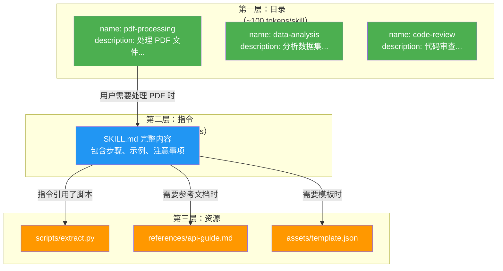
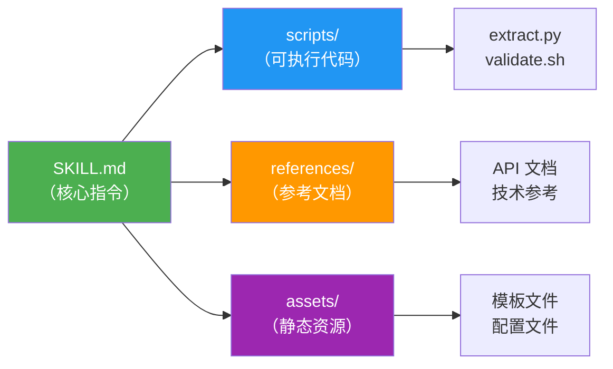
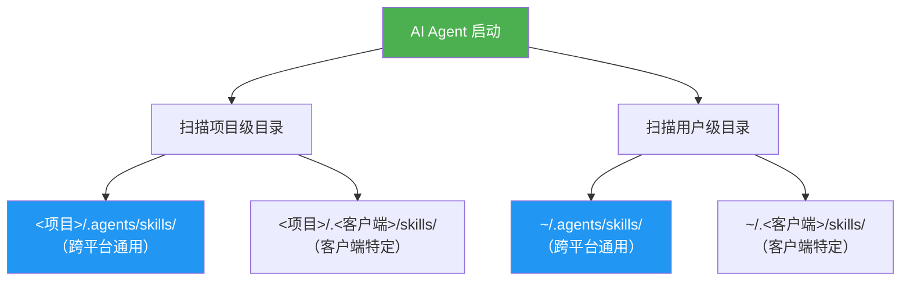
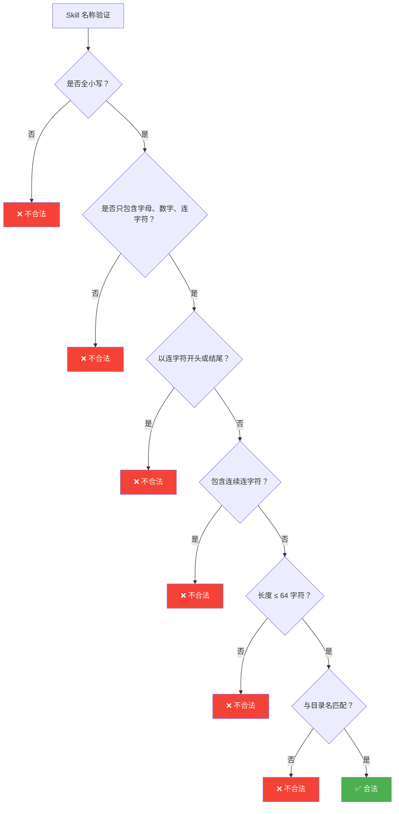
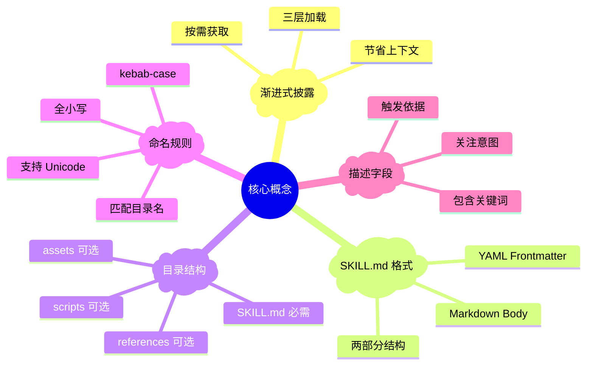

# 第二章：核心概念

> 本章深入讲解 Agent Skills 的核心概念，包括渐进式披露机制、SKILL.md 文件格式和目录结构约定。

## 2.1 渐进式披露（Progressive Disclosure）

**渐进式披露**是 Agent Skills 最重要的设计理念。它解决了一个关键问题：

> ❓ 如果 Agent 有 100 个 Skills，是否需要一次性加载所有内容？

答案是**不需要**。渐进式披露把信息分为三个层级，按需加载：



### 三层加载策略

| 层级 | 加载内容 | 加载时机 | Token 开销 |
|------|----------|----------|------------|
| **第一层：目录** | name + description | 会话开始时 | ~50-100 tokens/skill |
| **第二层：指令** | SKILL.md 完整正文 | Skill 被激活时 | < 5000 tokens（推荐） |
| **第三层：资源** | 脚本、参考文档、模板 | 指令引用时 | 视文件大小 |

### 为什么这很重要？

AI Agent 的**上下文窗口**（Context Window）是有限的。想象一下：

```
上下文窗口容量：128K tokens
├── 系统提示词：~2000 tokens
├── 对话历史：~10000 tokens
├── 如果一次加载 50 个 Skill（每个 5000 tokens）
│   → 需要 250,000 tokens ❌ 超出容量！
│
├── 渐进式披露方式：
│   ├── 50 个 Skill 目录（每个 100 tokens）= 5000 tokens
│   └── 只加载 1-2 个相关 Skill = 10000 tokens
│   → 总共只需 15,000 tokens ✅
```

## 2.2 SKILL.md 文件格式

`SKILL.md` 是 Agent Skills 的核心文件，由两部分组成：

### 文件结构

```
┌─────────────────────────────┐
│ ---                         │ ← Frontmatter 开始标记
│ name: my-skill              │
│ description: 描述信息...     │   YAML Frontmatter
│ license: MIT                │   （元数据）
│ ---                         │ ← Frontmatter 结束标记
│                             │
│ # My Skill                  │
│                             │
│ ## 使用场景                  │   Markdown Body
│ 当用户需要...                │   （指令正文）
│                             │
│ ## 操作步骤                  │
│ 1. 第一步...                 │
│ 2. 第二步...                 │
└─────────────────────────────┘
```

### Frontmatter（元数据）

Frontmatter 是文件顶部 `---` 标记之间的 YAML 内容，定义了 Skill 的元信息：

```yaml
---
name: pdf-processing
description: Extract PDF text, fill forms, merge files. Use when handling PDFs.
license: Apache-2.0
compatibility: Requires Python 3.11+ and pdfplumber
metadata:
  author: example-org
  version: "1.0"
allowed-tools: Bash(python3:*) Read
---
```

**字段说明**：

| 字段 | 必需 | 说明 | 限制 |
|------|------|------|------|
| `name` | ✅ 是 | Skill 标识符，kebab-case 格式 | 最多 64 字符 |
| `description` | ✅ 是 | 描述 Skill 的用途和激活条件 | 最多 1024 字符 |
| `license` | ❌ 否 | 许可证信息 | 无限制 |
| `compatibility` | ❌ 否 | 环境要求 | 最多 500 字符 |
| `metadata` | ❌ 否 | 自定义键值对 | 无限制 |
| `allowed-tools` | ❌ 否 | 预授权工具列表（实验性） | 空格分隔 |

### Body（指令正文）

Frontmatter 之后的 Markdown 内容就是 AI Agent 在激活 Skill 后会读取的指令。对格式没有特殊要求，推荐包含：

- 📋 分步指令
- 💡 输入/输出示例
- ⚠️ 常见边界情况

## 2.3 目录结构约定

一个完整的 Skill 目录结构如下：

```
skill-name/             ← 目录名必须与 name 字段匹配
├── SKILL.md            ← 必需：元数据 + 指令
├── scripts/            ← 可选：可执行脚本
│   ├── extract.py
│   └── validate.sh
├── references/         ← 可选：参考文档
│   ├── REFERENCE.md
│   └── api-guide.md
└── assets/             ← 可选：静态资源
    ├── template.json
    └── config.yaml
```

### 各目录的作用



| 目录 | 用途 | 加载时机 |
|------|------|----------|
| `SKILL.md` | Agent 的主要指令，包含步骤和示例 | Skill 激活时 |
| `scripts/` | Agent 可以运行的脚本代码 | 指令中引用时 |
| `references/` | 补充参考文档 | 指令中引用时 |
| `assets/` | 模板、配置、图片等静态资源 | 指令中引用时 |

## 2.4 Skill 发现机制

Agent 在启动时会扫描特定目录来发现可用的 Skills：

### 扫描位置



**优先级规则**：项目级 Skills 覆盖用户级 Skills（同名时）。

### 发现过程

```python
# 伪代码：Skill 发现过程
def discover_skills(project_dir, home_dir):
    skills = {}
    
    # 1. 扫描用户级（低优先级）
    for skill_dir in scan(home_dir / ".agents/skills/"):
        if has_skill_md(skill_dir):
            props = read_frontmatter(skill_dir / "SKILL.md")
            skills[props.name] = props
    
    # 2. 扫描项目级（高优先级，覆盖同名 Skill）
    for skill_dir in scan(project_dir / ".agents/skills/"):
        if has_skill_md(skill_dir):
            props = read_frontmatter(skill_dir / "SKILL.md")
            skills[props.name] = props  # 覆盖同名的用户级 Skill
    
    return skills
```

## 2.5 命名规则

Skill 名称（`name` 字段）有严格的规则：

### 有效命名

```yaml
# ✅ 正确示例
name: pdf-processing
name: data-analysis  
name: code-review
name: my-awesome-skill
```

### 无效命名

```yaml
# ❌ 错误示例
name: PDF-Processing     # 不允许大写字母
name: -pdf               # 不能以连字符开头
name: pdf-               # 不能以连字符结尾
name: pdf--processing    # 不能有连续连字符
name: pdf processing     # 不能有空格
name: pdf_processing     # 不能有下划线
```

### 命名规则图解



### 国际化支持

Agent Skills 支持 Unicode 字符，不仅限于 ASCII：

```yaml
# ✅ 支持 Unicode 字符
name: 技能示例       # 中文
name: навык         # 俄语（需要全小写）
```

名称在验证前会进行 **NFKC 标准化**处理，确保不同的 Unicode 编码方式被视为相同。

## 2.6 描述字段的重要性

`description` 字段决定了 Skill 是否会被激活——它是 Agent 判断是否使用该 Skill 的唯一依据。

### 好的描述 vs 差的描述

```yaml
# ❌ 差的描述——太笼统，Agent 不知道什么时候该用
description: Helps with PDFs.

# ✅ 好的描述——明确说明做什么、什么时候用
description: >
  Extract text and tables from PDF files, fill PDF forms, and merge 
  multiple PDFs. Use when working with PDF documents or when the user 
  mentions PDFs, forms, or document extraction.
```

### 描述编写原则

1. **使用祈使句**：说"当...时使用此 Skill"而不是"此 Skill 可以..."
2. **关注用户意图**：描述用户想要达到什么目的
3. **包含触发关键词**：列出应该触发该 Skill 的场景
4. **保持简洁**：最多 1024 字符

## 2.7 本章小结



| 概念 | 核心要点 |
|------|----------|
| 渐进式披露 | 三层加载：目录 → 指令 → 资源，按需获取 |
| SKILL.md | YAML frontmatter + Markdown body，两部分组成 |
| 目录结构 | `SKILL.md` 必需，`scripts/` `references/` `assets/` 可选 |
| 命名规则 | kebab-case、全小写、≤64 字符、匹配目录名 |
| 描述字段 | Agent 激活 Skill 的唯一依据，要写得明确具体 |

---

> ➡️ 下一章：[规范详解](./03-specification.md) — 深入了解每个 Frontmatter 字段的详细规定和验证规则。
