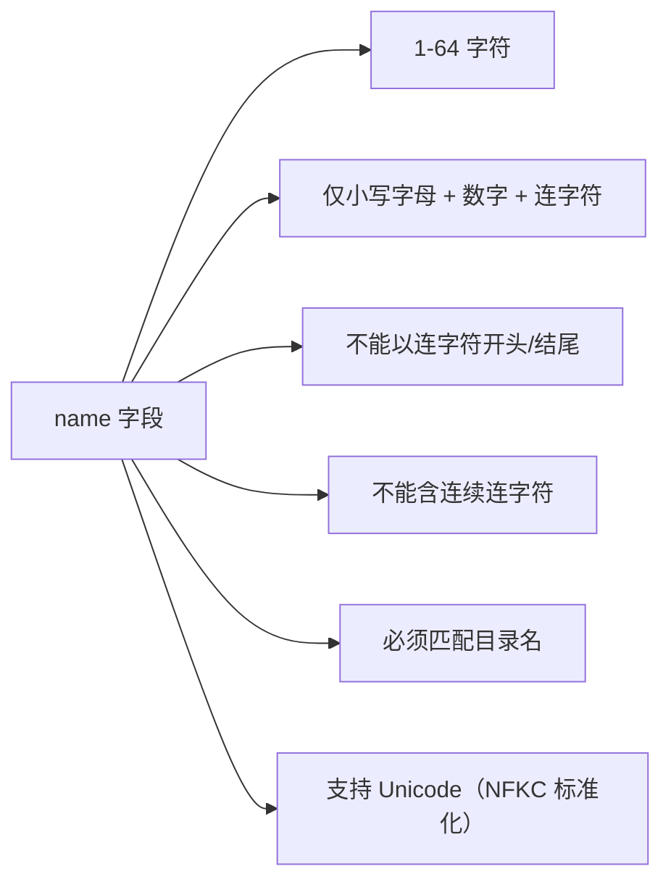
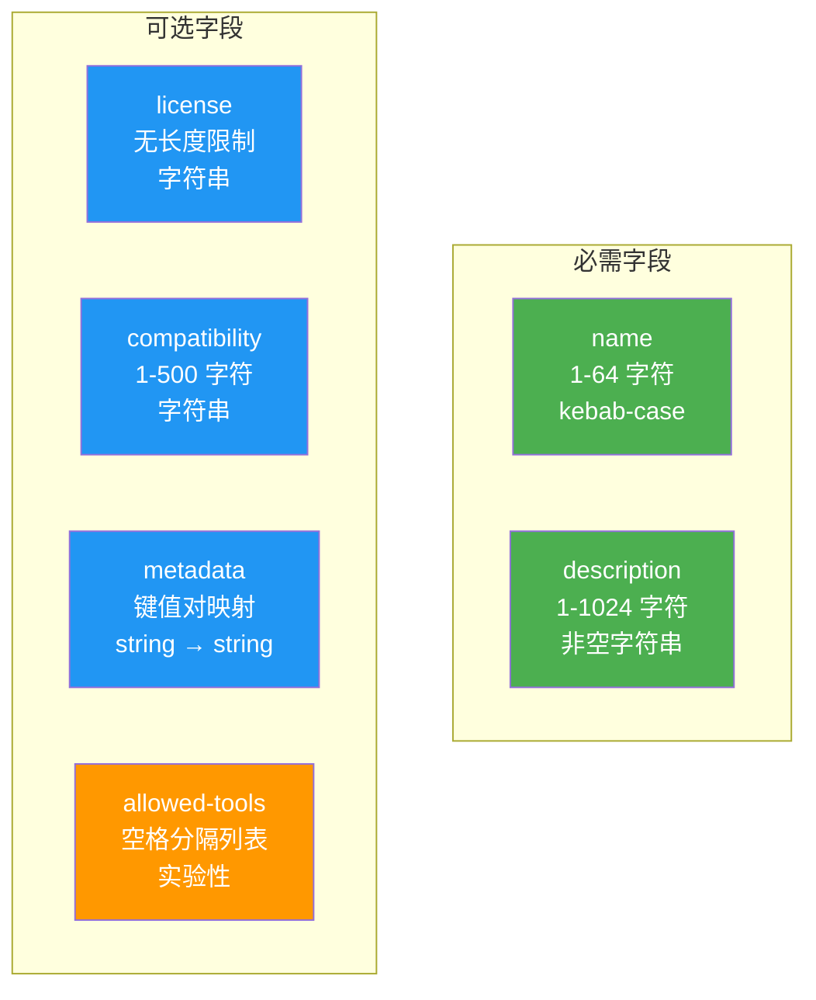
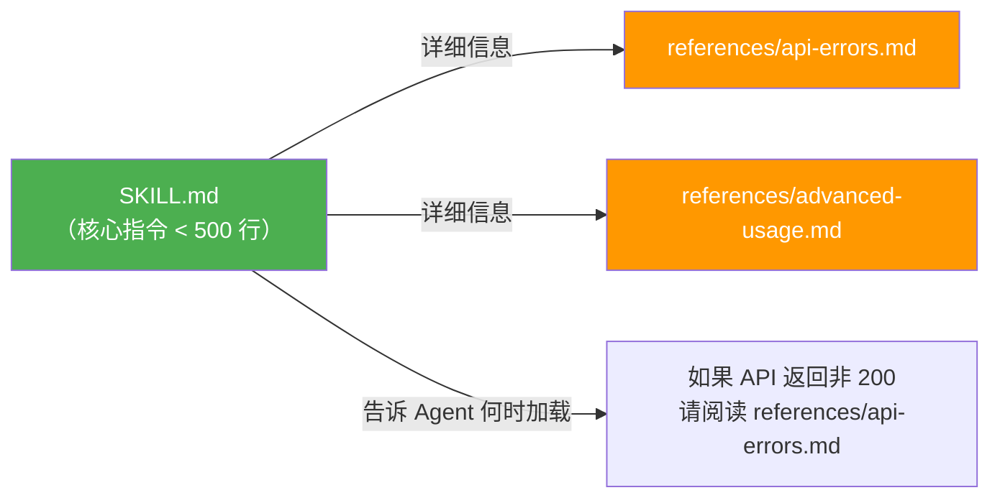
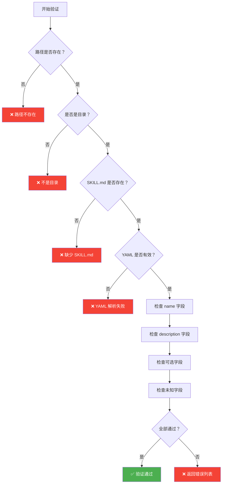

# 第三章：规范详解

> 本章详细解读 Agent Skills 的完整格式规范，包括每个字段的约束条件、验证规则和使用示例。

## 3.1 SKILL.md 完整格式

一个包含所有字段的 SKILL.md 示例：

```markdown
---
name: pdf-processing
description: >
  Extract text and tables from PDF files, fill PDF forms, 
  and merge multiple PDFs. Use when handling PDFs.
license: Apache-2.0
compatibility: Requires Python 3.11+ and pdfplumber
metadata:
  author: example-org
  version: "1.0"
allowed-tools: Bash(python3:*) Read
---

# PDF Processing

## When to use this skill
Use this skill when the user needs to work with PDF files...

## How to extract text
1. Use pdfplumber for text extraction...

## How to fill forms
...
```

## 3.2 必需字段详解

### `name` 字段

`name` 是 Skill 的唯一标识符，用于发现、激活和引用。

**约束条件**：



**示例**：

```yaml
# ✅ 正确
name: pdf-processing        # 标准 kebab-case
name: data-analysis         # 两个单词
name: a                     # 最短：1 字符
name: code-review-helper    # 三个单词

# ❌ 错误
name: PDF-Processing        # 大写字母
name: -pdf                  # 以连字符开头
name: pdf-                  # 以连字符结尾
name: pdf--process          # 连续连字符
name: pdf processing        # 包含空格
name: pdf_processing        # 包含下划线
```

**目录名匹配规则**：

```
✅ 正确：
pdf-processing/        ← 目录名
└── SKILL.md
    name: pdf-processing  ← 与目录名一致

❌ 错误：
my-folder/             ← 目录名
└── SKILL.md
    name: pdf-processing  ← 与目录名不匹配！
```

### `description` 字段

`description` 是 Agent 判断是否激活 Skill 的唯一依据。

**约束条件**：
- 必须是非空字符串
- 最多 1024 字符
- 应描述**做什么**和**什么时候用**

**好的描述模式**：

```yaml
# 模式 1：做什么 + 什么时候用
description: >
  Extract text and tables from PDF files, fill PDF forms, 
  and merge multiple PDFs. Use when working with PDF documents 
  or when the user mentions PDFs, forms, or document extraction.

# 模式 2：动作列表 + 触发条件
description: >
  Analyze CSV and tabular data files — compute summary statistics,
  add derived columns, generate charts, and clean messy data. Use 
  this skill when the user has a CSV, TSV, or Excel file.

# 模式 3：简短但精准
description: >
  Roll dice using a random number generator. Use when asked to 
  roll a die (d6, d20, etc.) or generate random dice rolls.
```

## 3.3 可选字段详解

### `license` 字段

指定 Skill 的许可证信息。

```yaml
# SPDX 许可证标识
license: Apache-2.0

# 引用许可文件
license: Proprietary. LICENSE.txt has complete terms

# MIT 许可
license: MIT
```

### `compatibility` 字段

描述 Skill 的环境要求（最多 500 字符）。

```yaml
# 指定运行环境
compatibility: Designed for Claude Code (or similar products)

# 指定依赖工具
compatibility: Requires git, docker, jq, and access to the internet

# 指定语言版本
compatibility: Requires Python 3.14+ and uv
```

> 💡 大多数 Skill 不需要此字段。只在有特殊环境要求时才使用。

### `metadata` 字段

自定义键值对，用于客户端特定的属性。

```yaml
metadata:
  author: example-org
  version: "1.0"
  category: data-processing
  tags: "csv, analysis, charts"
```

- 键和值都必须是字符串
- 建议使用独特的键名以避免冲突
- 客户端可以利用 metadata 存储自定义属性

### `allowed-tools` 字段（实验性）

指定 Skill 预授权可以使用的工具，以空格分隔。

```yaml
# 授权使用 git 和 jq 命令，以及文件读取
allowed-tools: Bash(git:*) Bash(jq:*) Read
```

> ⚠️ 这是实验性功能，不同 Agent 实现对此字段的支持可能不同。

## 3.4 字段约束汇总



| 字段 | 类型 | 必需 | 最大长度 | 验证规则 |
|------|------|------|----------|----------|
| `name` | string | ✅ | 64 字符 | 小写字母+数字+连字符, 不以连字符开头/结尾, 无连续连字符, 匹配目录名 |
| `description` | string | ✅ | 1024 字符 | 非空 |
| `license` | string | ❌ | 无限制 | 无 |
| `compatibility` | string | ❌ | 500 字符 | 非空（如果提供） |
| `metadata` | map | ❌ | 无限制 | key-value 都必须是 string |
| `allowed-tools` | string | ❌ | 无限制 | 空格分隔的工具模式列表 |

## 3.5 Frontmatter 字段限制

SKILL.md 的 frontmatter 中**只允许出现以上 6 个字段**。任何未知字段都会导致验证失败：

```yaml
---
name: my-skill
description: My skill description
author: John      # ❌ 不允许！"author" 不在允许列表中
version: 1.0      # ❌ 不允许！"version" 不在允许列表中
---
```

如果需要存储额外信息，请使用 `metadata` 字段：

```yaml
---
name: my-skill
description: My skill description
metadata:          # ✅ 正确做法
  author: John
  version: "1.0"
---
```

## 3.6 Body 内容指南

Frontmatter 之后的 Markdown 正文是 Agent 执行任务时的指令。虽然没有格式限制，但有以下推荐做法：

### 推荐的内容组织

```markdown
# Skill 标题

## 使用场景
说明什么时候应该使用这个 Skill...

## 操作步骤
1. 第一步：准备工作
2. 第二步：执行操作
3. 第三步：验证结果

## 示例
输入输出示例...

## 注意事项
- 边界情况处理
- 常见错误避免
```

### 文件引用

在 SKILL.md 中引用其他文件时，使用**相对于 Skill 根目录的路径**：

````markdown
## 可用脚本

- `scripts/extract.py` — 提取数据
- `scripts/validate.sh` — 验证结果

## 详细参考

查看 [API 参考](references/api-guide.md) 获取更多信息。

## 工作流程

1. 运行提取脚本：
   ```bash
   python3 scripts/extract.py input.pdf
   ```
````

### 正文长度建议

- **推荐**：保持 `SKILL.md` 在 **500 行以内**、**5000 tokens 以内**
- **超出时**：将详细内容拆分到 `references/` 目录
- **原因**：正文一旦加载就占用上下文窗口空间



## 3.7 验证流程

使用 `skills-ref` 工具可以验证 Skill 是否符合规范：

```bash
# 验证 Skill 目录
skills-ref validate ./my-skill

# 输出示例（通过）：
# Valid skill: ./my-skill

# 输出示例（失败）：
# Validation failed for ./my-skill:
#   - Skill name 'My-Skill' must be lowercase
#   - Directory name 'my_skill' must match skill name 'my-skill'
```

### 验证检查项



## 3.8 完整示例

### 最小示例

```markdown
---
name: hello-world
description: A simple greeting skill. Use when the user wants to say hello.
---

Greet the user warmly and ask how you can help them today.
```

### 完整示例

````markdown
---
name: pdf-processing
description: >
  Extract text and tables from PDF files, fill PDF forms, 
  and merge multiple PDFs. Use when handling PDFs.
license: Apache-2.0
compatibility: Requires Python 3.11+ and pdfplumber
metadata:
  author: example-org
  version: "1.0"
---

# PDF Processing

## When to use this skill
Use this skill when the user needs to:
- Extract text from PDF files
- Fill in PDF forms
- Merge multiple PDFs into one

## How to extract text

Use pdfplumber for text extraction. For scanned documents, 
fall back to pdf2image with pytesseract.

```python
import pdfplumber

with pdfplumber.open("file.pdf") as pdf:
    text = pdf.pages[0].extract_text()
```

## Available scripts

- `scripts/extract.py` — Extract text from PDF
- `scripts/merge.py` — Merge multiple PDFs
- `scripts/fill_form.py` — Fill PDF forms

## Gotchas

- Some PDFs are scanned images, not text. Use OCR for these.
- Password-protected PDFs need the password before processing.
- Large PDFs (>100 pages) should be processed in chunks.
````

## 3.9 本章小结

| 要点 | 说明 |
|------|------|
| 必需字段 | `name`（kebab-case, ≤64 字符）和 `description`（≤1024 字符） |
| 可选字段 | `license`、`compatibility`、`metadata`、`allowed-tools` |
| 字段限制 | 只允许 6 个指定字段，其他字段验证失败 |
| 正文建议 | ≤500 行、≤5000 tokens，大内容拆分到 references/ |
| 文件引用 | 使用相对路径，相对于 Skill 根目录 |

---

> ➡️ 下一章：[动手实践：创建第一个 Skill](./04-quickstart.md) — 从零创建一个可工作的 Skill。
