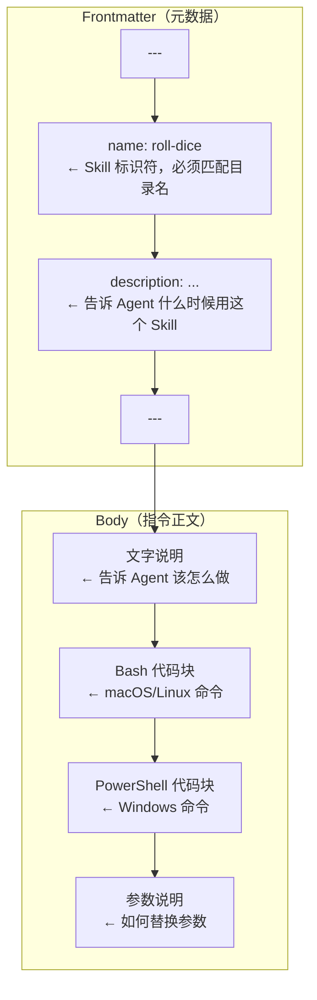
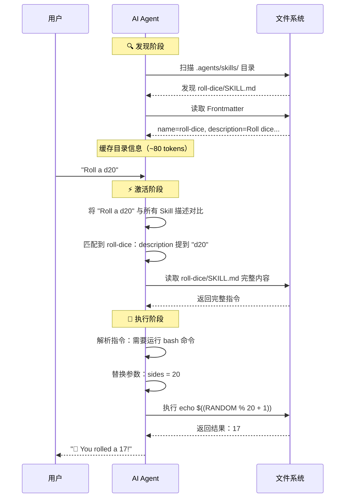
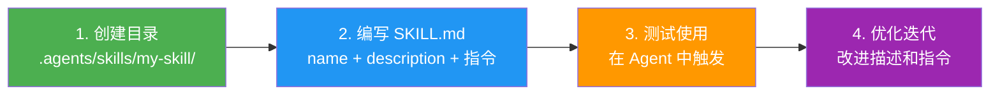

# 第四章：动手实践 —— 创建第一个 Skill

> 本章将手把手教你创建一个真实可用的 Agent Skill，并在 VS Code 中测试它。

## 4.1 目标

我们将创建一个 **掷骰子 Skill**（roll-dice），让 AI Agent 能够模拟掷骰子。

最终效果：
- 用户说"帮我掷一个 D20"
- Agent 自动识别并激活 roll-dice Skill
- Agent 按照 Skill 指令运行命令
- 返回一个 1-20 之间的随机数

## 4.2 前置准备

你需要：
- 一个项目目录（任何现有项目都行）
- [VS Code](https://code.visualstudio.com/) + [GitHub Copilot](https://marketplace.visualstudio.com/items?itemName=GitHub.copilot) 扩展

> 💡 本教程以 VS Code 为例，但 Agent Skills 是开放格式——同样的 Skill 也可以在 Claude Code、OpenAI Codex 等平台上工作。

## 4.3 第一步：创建目录结构

在你的项目根目录下创建 Skill 目录：

```bash
# 创建 Skill 目录
mkdir -p .agents/skills/roll-dice
```

目录结构：

```
your-project/
├── .agents/
│   └── skills/
│       └── roll-dice/    ← 我们要在这里创建 Skill
│           └── SKILL.md  ← 即将创建的文件
└── ... (你的项目其他文件)
```

> 💡 VS Code 默认扫描 `.agents/skills/` 目录来发现 Skills。

## 4.4 第二步：编写 SKILL.md

创建文件 `.agents/skills/roll-dice/SKILL.md`，内容如下：

````markdown
---
name: roll-dice
description: >
  Roll dice using a random number generator. Use when asked to roll 
  a die (d6, d20, etc.), roll dice, or generate a random dice roll.
---

To roll a die, use the following command that generates a random 
number from 1 to the given number of sides:

```bash
echo $((RANDOM % <sides> + 1))
```

```powershell
Get-Random -Minimum 1 -Maximum (<sides> + 1)
```

Replace `<sides>` with the number of sides on the die (e.g., 6 for 
a standard die, 20 for a d20).
````

### 逐行解读



关键要点：

| 部分 | 内容 | 作用 |
|------|------|------|
| `name: roll-dice` | Skill 名称 | 用于标识，必须与目录名 `roll-dice` 匹配 |
| `description: ...` | Skill 描述 | Agent 据此判断是否激活该 Skill |
| 正文 | 操作指令 | Agent 激活后遵循的具体步骤 |

## 4.5 第三步：测试 Skill

1. **打开 VS Code**，打开你的项目
2. **打开 Copilot Chat** 面板
3. 在模式下拉菜单中选择 **Agent** 模式
4. 输入 `/skills` 确认 `roll-dice` 出现在列表中
5. 输入：**"Roll a d20"**

### 预期结果

Agent 应该：
1. 识别到你的请求与 roll-dice Skill 的描述匹配
2. 激活 Skill，读取完整的 SKILL.md
3. 按照指令运行终端命令
4. 返回 1-20 之间的随机数

```
用户：Roll a d20
Agent：Let me roll a d20 for you.
      [运行命令：echo $((RANDOM % 20 + 1))]
      🎲 You rolled a 17!
```

## 4.6 背后发生了什么？

让我们回顾整个过程：



## 4.7 练习：创建一个更复杂的 Skill

尝试创建一个 **密码生成器 Skill**：

### 第一步：创建目录

```bash
mkdir -p .agents/skills/password-generator
```

### 第二步：编写 SKILL.md

````markdown
---
name: password-generator
description: >
  Generate secure random passwords with configurable length and 
  character sets. Use when asked to create, generate, or make 
  a password, passphrase, or secure string.
---

# Password Generator

## How to generate a password

Use the following command to generate a secure random password:

```bash
# Generate a random password of specified length
# Replace <length> with the desired number of characters (default: 16)
LC_ALL=C tr -dc 'A-Za-z0-9!@#$%^&*' < /dev/urandom | head -c <length>
echo  # Add newline
```

```powershell
# PowerShell version
-join ((65..90) + (97..122) + (48..57) + (33,64,35,36,37,94,38,42) | 
  Get-Random -Count <length> | ForEach-Object {[char]$_})
```

## Options

- Default length: 16 characters
- Include: uppercase, lowercase, digits, special characters
- If the user specifies requirements (e.g., "no special characters"), 
  adjust the character set accordingly

## Examples

- "Generate a password" → 16 character password with all character types
- "Make a 32 character password" → 32 character password
- "Create a password with only letters and numbers" → Alphanumeric only
````

### 第三步：验证结构

```
your-project/
├── .agents/
│   └── skills/
│       ├── roll-dice/
│       │   └── SKILL.md    ✅
│       └── password-generator/
│           └── SKILL.md    ✅
```

### 第四步：测试

在 VS Code 的 Copilot Chat 中尝试：
- "Generate a strong password"
- "Create a 24-character password with no special characters"

## 4.8 使用 skills-ref 验证

如果你安装了 Python 参考库（详见[第五章](./05-reference-library.md)），可以用命令行验证：

```bash
# 验证 Skill
skills-ref validate .agents/skills/roll-dice

# 输出：Valid skill: .agents/skills/roll-dice

# 读取属性
skills-ref read-properties .agents/skills/roll-dice

# 输出：
# {
#   "name": "roll-dice",
#   "description": "Roll dice using a random number generator..."
# }

# 生成提示词 XML
skills-ref to-prompt .agents/skills/roll-dice .agents/skills/password-generator

# 输出：
# <available_skills>
# <skill>
# <name>roll-dice</name>
# <description>Roll dice using a random number generator...</description>
# <location>/path/to/.agents/skills/roll-dice/SKILL.md</location>
# </skill>
# <skill>
# <name>password-generator</name>
# <description>Generate secure random passwords...</description>
# <location>/path/to/.agents/skills/password-generator/SKILL.md</location>
# </skill>
# </available_skills>
```

## 4.9 常见问题排查

| 问题 | 原因 | 解决方法 |
|------|------|----------|
| Skill 不出现在列表中 | 文件位置不对 | 确认路径是 `.agents/skills/<name>/SKILL.md` |
| Agent 不激活 Skill | description 不够明确 | 优化描述，包含更多触发关键词 |
| Agent 激活了但不执行命令 | 模型不支持工具使用 | 尝试切换其他模型 |
| 验证失败 | name 不匹配目录名 | 确保 `name` 字段与目录名完全一致 |
| YAML 解析错误 | 冒号等特殊字符 | 将 description 用引号包裹或使用 `>` 折叠块 |

## 4.10 本章小结

恭喜！🎉 你已经创建了第一个 Agent Skill。回顾一下关键步骤：



| 步骤 | 操作 |
|------|------|
| 创建目录 | `mkdir -p .agents/skills/<skill-name>` |
| 编写文件 | 创建 `SKILL.md`，包含 frontmatter 和指令 |
| 测试使用 | 在 Agent 中输入相关请求 |
| 验证 | 使用 `skills-ref validate` 检查格式 |

---

> ➡️ 下一章：[Python 参考库详解](./05-reference-library.md) — 了解 skills-ref 库的安装和使用。
