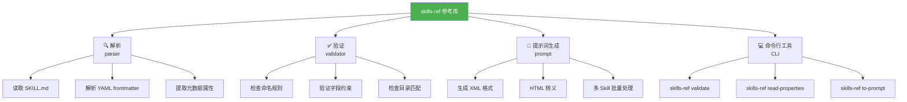
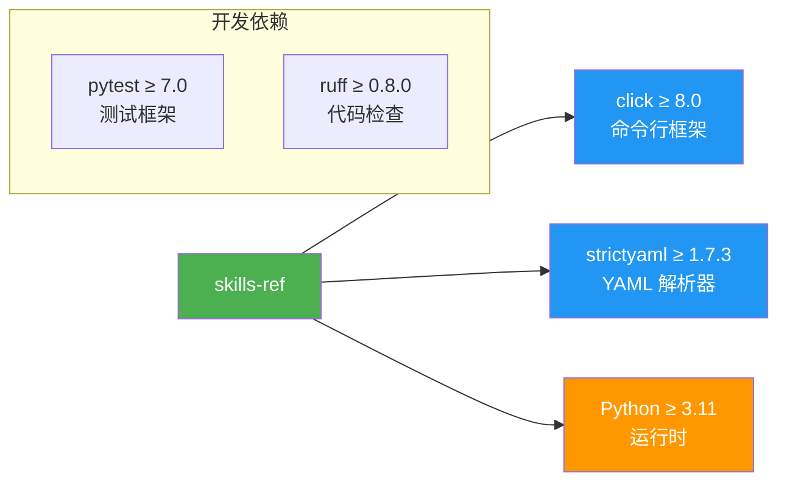
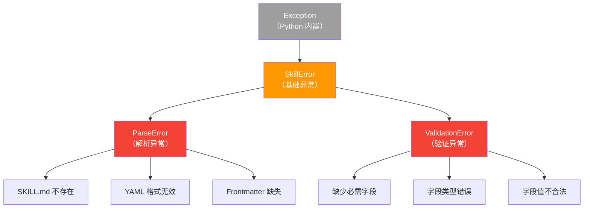
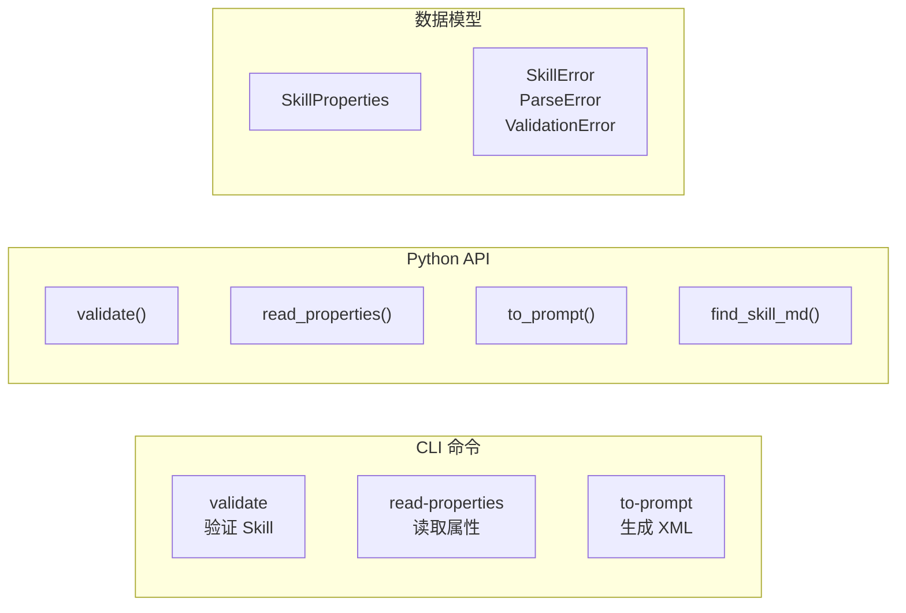

# 第五章：Python 参考库详解

> 本章详细介绍 skills-ref Python 参考库——它是 Agent Skills 的官方工具库，提供解析、验证和提示词生成等功能。

## 5.1 什么是 skills-ref？

`skills-ref` 是 Agent Skills 的 **Python 参考实现**，提供了一套工具来处理 SKILL.md 文件：



> ⚠️ **注意**：此库仅供演示和参考使用，不适用于生产环境。

## 5.2 安装

### macOS / Linux

**方式一：使用 pip**

```bash
cd skills-ref

# 创建虚拟环境
python -m venv .venv
source .venv/bin/activate

# 安装（可编辑模式）
pip install -e .
```

**方式二：使用 uv（更快）**

```bash
cd skills-ref

# 使用 uv 同步依赖
uv sync

# 激活虚拟环境
source .venv/bin/activate
```

### Windows

```powershell
cd skills-ref

# 创建虚拟环境
python -m venv .venv
.venv\Scripts\Activate.ps1

# 安装
pip install -e .
```

### 验证安装

```bash
skills-ref --version
# 输出: skills-ref, version 0.1.0
```

## 5.3 依赖介绍



| 依赖 | 版本 | 用途 |
|------|------|------|
| `click` | ≥ 8.0 | CLI 框架，处理命令行参数和输出 |
| `strictyaml` | ≥ 1.7.3 | 安全的 YAML 解析器（比 PyYAML 更严格） |
| `pytest` | ≥ 7.0 | 测试框架（开发依赖） |
| `ruff` | ≥ 0.8.0 | 代码风格检查（开发依赖） |

## 5.4 命令行工具（CLI）

安装后，`skills-ref` 命令可在终端使用。它提供三个子命令：

### `validate` — 验证 Skill

```bash
# 验证一个 Skill 目录
skills-ref validate path/to/my-skill

# 也可以直接指定 SKILL.md 文件
skills-ref validate path/to/my-skill/SKILL.md
```

**成功输出**：

```
Valid skill: path/to/my-skill
```

**失败输出**：

```
Validation failed for path/to/my-skill:
  - Skill name 'My-Skill' must be lowercase
  - Directory name 'my_skill' must match skill name 'my-skill'
```

### `read-properties` — 读取属性

```bash
# 输出 Skill 属性的 JSON 格式
skills-ref read-properties path/to/my-skill
```

**输出示例**：

```json
{
  "name": "pdf-processing",
  "description": "Extract PDF text, fill forms, merge files.",
  "license": "Apache-2.0",
  "compatibility": "Requires Python 3.11+",
  "metadata": {
    "author": "example-org",
    "version": "1.0"
  }
}
```

### `to-prompt` — 生成提示词 XML

```bash
# 为一个或多个 Skill 生成 XML
skills-ref to-prompt path/to/skill-a path/to/skill-b
```

**输出示例**：

```xml
<available_skills>
<skill>
<name>
skill-a
</name>
<description>
Description of skill A
</description>
<location>
/absolute/path/to/skill-a/SKILL.md
</location>
</skill>
<skill>
<name>
skill-b
</name>
<description>
Description of skill B
</description>
<location>
/absolute/path/to/skill-b/SKILL.md
</location>
</skill>
</available_skills>
```

## 5.5 Python API

除了命令行，你也可以在 Python 代码中使用 skills-ref。

### 导入

```python
from pathlib import Path
from skills_ref import (
    SkillProperties,      # 数据模型
    validate,             # 验证函数
    read_properties,      # 读取属性
    find_skill_md,        # 查找 SKILL.md
    to_prompt,            # 生成提示词
    SkillError,           # 基础异常
    ParseError,           # 解析异常
    ValidationError,      # 验证异常
)
```

### 验证 Skill

```python
from pathlib import Path
from skills_ref import validate

# validate() 返回错误列表，空列表 = 验证通过
errors = validate(Path("my-skill"))

if errors:
    print("验证失败：")
    for error in errors:
        print(f"  - {error}")
else:
    print("✅ 验证通过")
```

### 读取属性

```python
from pathlib import Path
from skills_ref import read_properties, ParseError, ValidationError

try:
    props = read_properties(Path("my-skill"))
    
    print(f"名称: {props.name}")
    print(f"描述: {props.description}")
    print(f"许可证: {props.license}")
    print(f"兼容性: {props.compatibility}")
    print(f"元数据: {props.metadata}")
    
    # 序列化为字典
    data = props.to_dict()
    print(data)

except ParseError as e:
    print(f"解析错误: {e}")
except ValidationError as e:
    print(f"验证错误: {e}")
```

### 生成提示词

```python
from pathlib import Path
from skills_ref import to_prompt

# 为多个 Skill 生成 XML 格式的提示词
xml = to_prompt([
    Path("skills/pdf-processing"),
    Path("skills/data-analysis"),
])

print(xml)
# 输出 <available_skills>...</available_skills> XML
```

### 查找 SKILL.md

```python
from pathlib import Path
from skills_ref import find_skill_md

# 查找 Skill 目录中的 SKILL.md 文件
# 优先返回 SKILL.md（大写），其次 skill.md（小写）
path = find_skill_md(Path("my-skill"))

if path:
    print(f"找到: {path}")
else:
    print("未找到 SKILL.md")
```

## 5.6 数据模型：SkillProperties

`SkillProperties` 是一个 Python 数据类（dataclass），表示 Skill 的元数据：

```python
from dataclasses import dataclass, field
from typing import Optional

@dataclass
class SkillProperties:
    name: str                              # 必需：Skill 名称
    description: str                       # 必需：Skill 描述
    license: Optional[str] = None          # 可选：许可证
    compatibility: Optional[str] = None    # 可选：兼容性信息
    allowed_tools: Optional[str] = None    # 可选：允许的工具
    metadata: dict[str, str] = field(default_factory=dict)  # 可选：元数据

    def to_dict(self) -> dict:
        """转换为字典，排除 None 值"""
        result = {"name": self.name, "description": self.description}
        if self.license is not None:
            result["license"] = self.license
        if self.compatibility is not None:
            result["compatibility"] = self.compatibility
        if self.allowed_tools is not None:
            result["allowed-tools"] = self.allowed_tools  # 注意：key 用连字符
        if self.metadata:
            result["metadata"] = self.metadata
        return result
```

### 使用示例

```python
# 创建 SkillProperties 实例
props = SkillProperties(
    name="my-skill",
    description="A demonstration skill",
    license="MIT",
    metadata={"author": "team-a"}
)

# 访问属性
print(props.name)         # "my-skill"
print(props.description)  # "A demonstration skill"

# 转换为字典
data = props.to_dict()
# {
#   "name": "my-skill",
#   "description": "A demonstration skill",
#   "license": "MIT",
#   "metadata": {"author": "team-a"}
# }
```

## 5.7 异常层次结构



```python
from skills_ref import SkillError, ParseError, ValidationError

try:
    props = read_properties(Path("some-skill"))
except ParseError as e:
    # SKILL.md 文件不存在、YAML 格式无效等
    print(f"解析错误: {e}")
except ValidationError as e:
    # 缺少 name/description、字段值不合法等
    print(f"验证错误: {e}")
    print(f"错误列表: {e.errors}")
except SkillError as e:
    # 捕获所有 Skill 相关错误
    print(f"Skill 错误: {e}")
```

## 5.8 运行测试

```bash
cd skills-ref

# 运行所有测试
pytest

# 运行指定模块的测试
pytest tests/test_parser.py
pytest tests/test_validator.py
pytest tests/test_prompt.py

# 详细输出
pytest -v
```

测试覆盖范围：

| 测试文件 | 测试数量 | 覆盖范围 |
|----------|----------|----------|
| `test_parser.py` | ~40 | 解析、文件查找、YAML 处理 |
| `test_validator.py` | ~65 | 命名规则、字段验证、i18n 支持 |
| `test_prompt.py` | ~6 | XML 生成、特殊字符转义 |

## 5.9 本章小结



| 功能 | CLI 命令 | Python API |
|------|----------|------------|
| 验证 | `skills-ref validate <path>` | `validate(Path)` |
| 读取属性 | `skills-ref read-properties <path>` | `read_properties(Path)` |
| 生成提示词 | `skills-ref to-prompt <paths...>` | `to_prompt([Path])` |
| 查找文件 | — | `find_skill_md(Path)` |

---

> ➡️ 下一章：[源码深度解析](./06-source-code-analysis.md) — 逐模块分析 Python 参考库的实现细节。
