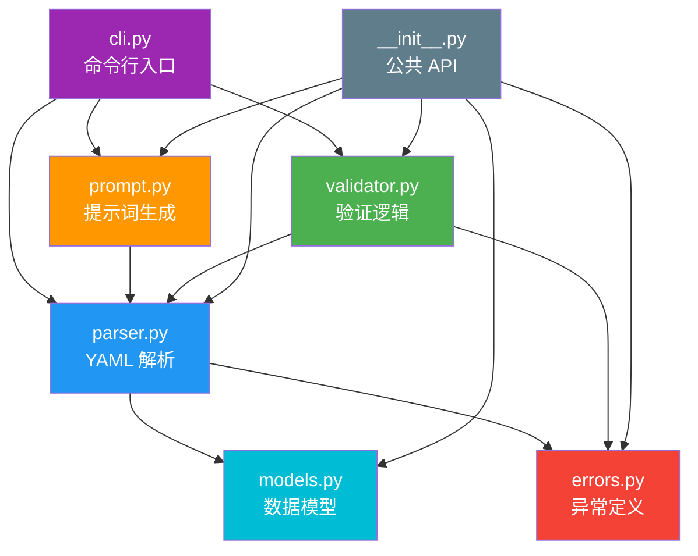
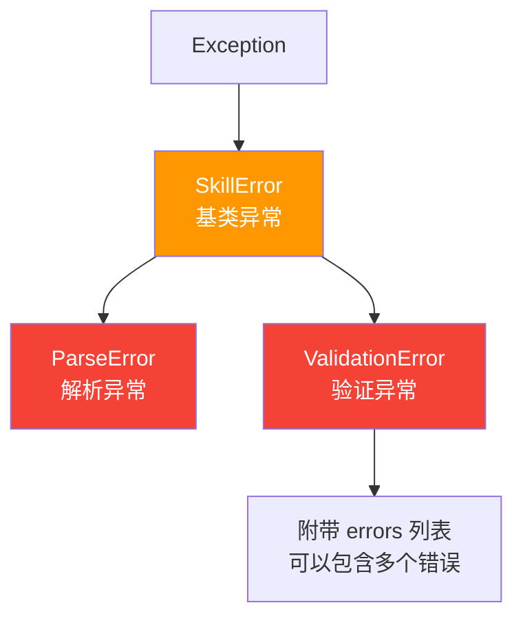
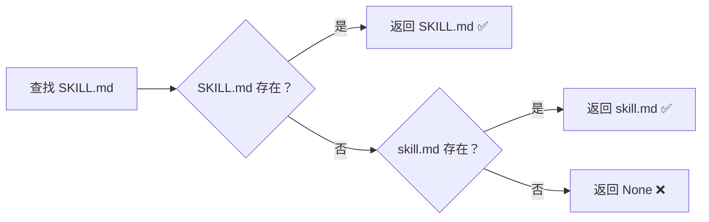
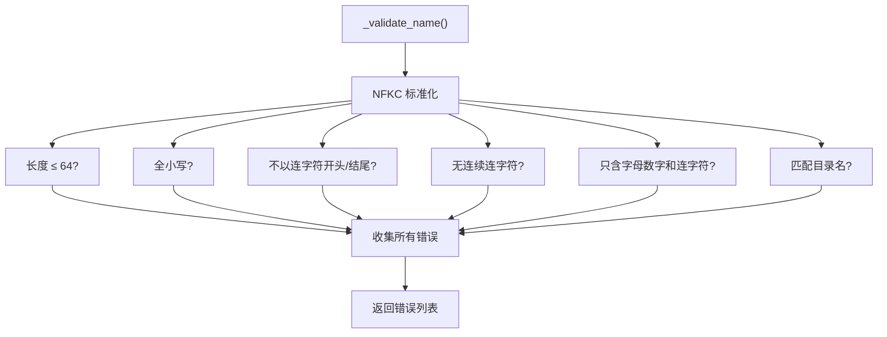
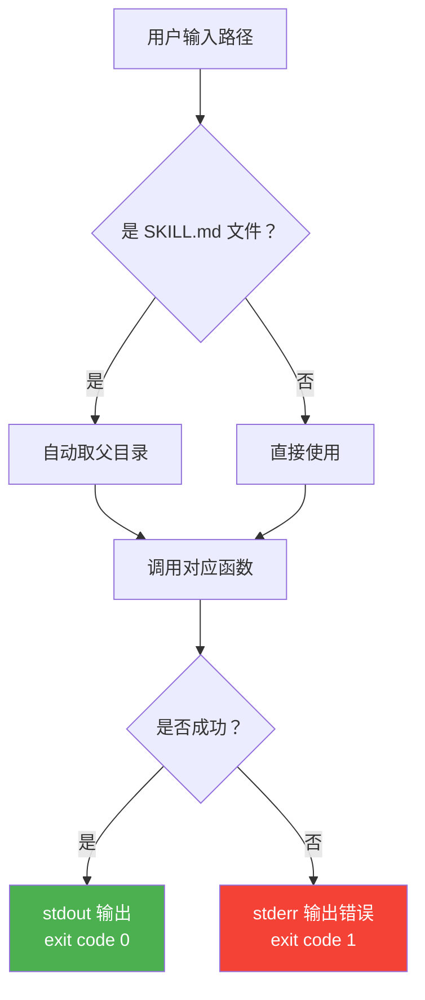
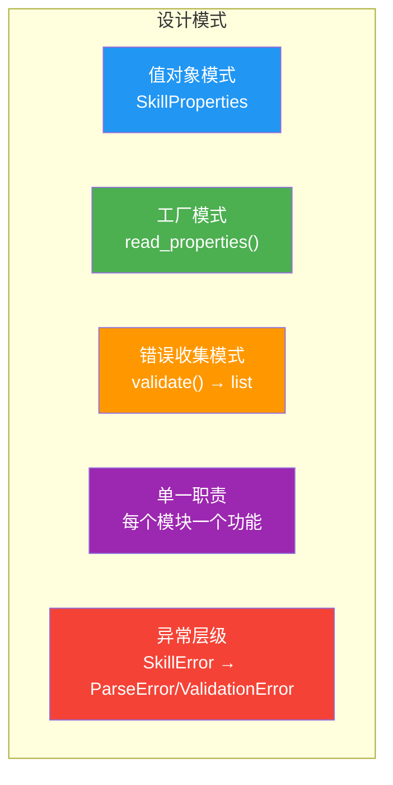

# 第六章：源码深度解析

> 本章逐模块分析 skills-ref Python 参考库的实现细节，帮助你理解其设计模式和架构思想。

## 6.1 项目结构

```
skills-ref/
├── src/skills_ref/          # 源码目录
│   ├── __init__.py          # 公共 API 入口
│   ├── models.py            # 数据模型
│   ├── parser.py            # YAML 解析器
│   ├── validator.py         # 验证器
│   ├── prompt.py            # 提示词生成
│   ├── errors.py            # 异常定义
│   └── cli.py               # 命令行接口
├── tests/                   # 测试目录
│   ├── test_parser.py       # 解析器测试
│   ├── test_validator.py    # 验证器测试
│   └── test_prompt.py       # 提示词测试
└── pyproject.toml           # 项目配置
```

## 6.2 模块依赖关系



数据流向：

```
用户调用 CLI/API
    │
    ▼
parser.py ──读取文件──→ 解析 YAML ──→ 构建 SkillProperties
    │
    ├──→ validator.py ──→ 返回错误列表
    │
    └──→ prompt.py ──→ 生成 XML 提示词
```

## 6.3 errors.py — 异常定义

这是最简单的模块，定义了三个异常类：

```python
class SkillError(Exception):
    """所有 Skill 相关错误的基类"""
    pass

class ParseError(SkillError):
    """SKILL.md 解析失败时抛出"""
    pass

class ValidationError(SkillError):
    """Skill 属性验证失败时抛出"""
    def __init__(self, message: str, errors: list[str] | None = None):
        super().__init__(message)
        self.errors = errors if errors is not None else [message]
```

### 设计亮点



- **异常层级结构**：可以精确捕获特定错误，也可以用基类统一捕获
- **ValidationError** 带有 `errors` 列表：支持一次返回多个验证错误
- **继承自 Exception**：遵循 Python 标准异常规范

## 6.4 models.py — 数据模型

定义了 `SkillProperties` 数据类：

```python
@dataclass
class SkillProperties:
    name: str                              # 必需
    description: str                       # 必需
    license: Optional[str] = None          # 可选
    compatibility: Optional[str] = None    # 可选
    allowed_tools: Optional[str] = None    # 可选
    metadata: dict[str, str] = field(default_factory=dict)  # 可选

    def to_dict(self) -> dict:
        """转换为字典，排除 None 值"""
        result = {"name": self.name, "description": self.description}
        if self.license is not None:
            result["license"] = self.license
        if self.compatibility is not None:
            result["compatibility"] = self.compatibility
        if self.allowed_tools is not None:
            result["allowed-tools"] = self.allowed_tools  # 注意这里！
        if self.metadata:
            result["metadata"] = self.metadata
        return result
```

### 设计分析

**1. 使用 `@dataclass` 装饰器**

```python
# dataclass 自动生成 __init__, __repr__, __eq__ 等方法
# 等价于手写：
class SkillProperties:
    def __init__(self, name, description, license=None, ...):
        self.name = name
        self.description = description
        # ...
    
    def __repr__(self):
        return f"SkillProperties(name={self.name!r}, ...)"
    
    def __eq__(self, other):
        return self.name == other.name and ...
```

**2. `to_dict()` 的巧妙设计**

```python
# 注意：allowed_tools (Python 属性名) → "allowed-tools" (YAML 字段名)
# Python 属性名用下划线，YAML 字段名用连字符
if self.allowed_tools is not None:
    result["allowed-tools"] = self.allowed_tools  # 键名转换！
```

**3. 可变默认值的正确处理**

```python
# ❌ 错误写法（所有实例共享同一个 dict）
metadata: dict[str, str] = {}

# ✅ 正确写法（每个实例创建独立的 dict）
metadata: dict[str, str] = field(default_factory=dict)
```

## 6.5 parser.py — YAML 解析器

解析器是整个库的核心，负责读取和解析 SKILL.md 文件。

### `find_skill_md()` — 查找文件

```python
def find_skill_md(skill_dir: Path) -> Optional[Path]:
    """优先查找 SKILL.md（大写），其次 skill.md（小写）"""
    for name in ("SKILL.md", "skill.md"):
        path = skill_dir / name
        if path.exists():
            return path
    return None
```

优先级规则：



### `parse_frontmatter()` — 解析 Frontmatter

```python
def parse_frontmatter(content: str) -> tuple[dict, str]:
    """将 SKILL.md 内容分解为元数据和正文"""
    
    # 1. 检查是否以 --- 开头
    if not content.startswith("---"):
        raise ParseError("SKILL.md must start with YAML frontmatter (---)")
    
    # 2. 按 --- 分割内容
    parts = content.split("---", 2)
    # parts[0] = "" (--- 之前的空内容)
    # parts[1] = YAML 内容
    # parts[2] = Markdown 正文
    
    if len(parts) < 3:
        raise ParseError("SKILL.md frontmatter not properly closed with ---")
    
    # 3. 用 strictyaml 解析 YAML
    frontmatter_str = parts[1]
    body = parts[2].strip()
    parsed = strictyaml.load(frontmatter_str)
    metadata = parsed.data
    
    # 4. 处理 metadata 字段（确保键值都是字符串）
    if "metadata" in metadata and isinstance(metadata["metadata"], dict):
        metadata["metadata"] = {
            str(k): str(v) for k, v in metadata["metadata"].items()
        }
    
    return metadata, body
```

解析过程图解：

```
输入内容：
┌──────────────────────────┐
│ ---                      │ ← parts[0] = "" (空)
│ name: my-skill           │
│ description: A skill     │ ← parts[1] = YAML 内容
│ ---                      │
│                          │
│ # My Skill               │
│ Instructions here...     │ ← parts[2] = Markdown 正文
└──────────────────────────┘

输出：
  metadata = {"name": "my-skill", "description": "A skill"}
  body = "# My Skill\nInstructions here..."
```

### `read_properties()` — 读取属性

```python
def read_properties(skill_dir: Path) -> SkillProperties:
    """完整的解析流程：找到文件 → 解析 → 验证 → 构建对象"""
    
    # 1. 查找 SKILL.md
    skill_md = find_skill_md(skill_dir)
    if skill_md is None:
        raise ParseError(f"SKILL.md not found in {skill_dir}")
    
    # 2. 读取并解析
    content = skill_md.read_text()
    metadata, _ = parse_frontmatter(content)
    
    # 3. 基础验证
    if "name" not in metadata:
        raise ValidationError("Missing required field: name")
    if "description" not in metadata:
        raise ValidationError("Missing required field: description")
    
    # 4. 构建 SkillProperties
    return SkillProperties(
        name=metadata["name"].strip(),
        description=metadata["description"].strip(),
        license=metadata.get("license"),
        compatibility=metadata.get("compatibility"),
        allowed_tools=metadata.get("allowed-tools"),
        metadata=metadata.get("metadata"),
    )
```


## 6.6 validator.py — 验证器

验证器模块实现了全面的 Skill 验证逻辑。

### 常量定义

```python
MAX_SKILL_NAME_LENGTH = 64
MAX_DESCRIPTION_LENGTH = 1024
MAX_COMPATIBILITY_LENGTH = 500

ALLOWED_FIELDS = {
    "name", "description", "license",
    "allowed-tools", "metadata", "compatibility",
}
```

### 名称验证 `_validate_name()`

```python
def _validate_name(name: str, skill_dir: Path) -> list[str]:
    errors = []
    
    # NFKC 标准化（处理 Unicode 不同编码形式）
    name = unicodedata.normalize("NFKC", name.strip())
    
    # 长度检查
    if len(name) > MAX_SKILL_NAME_LENGTH:
        errors.append(f"Skill name exceeds 64 character limit")
    
    # 全小写检查
    if name != name.lower():
        errors.append(f"Skill name must be lowercase")
    
    # 连字符位置检查
    if name.startswith("-") or name.endswith("-"):
        errors.append("Cannot start or end with a hyphen")
    
    # 连续连字符检查
    if "--" in name:
        errors.append("Cannot contain consecutive hyphens")
    
    # 字符集检查（只允许字母数字和连字符）
    if not all(c.isalnum() or c == "-" for c in name):
        errors.append("Only letters, digits, and hyphens are allowed")
    
    # 目录名匹配检查
    if skill_dir:
        dir_name = unicodedata.normalize("NFKC", skill_dir.name)
        if dir_name != name:
            errors.append(f"Directory name must match skill name")
    
    return errors
```

验证逻辑的流程：



### Unicode NFKC 标准化

这是一个值得关注的细节。为什么需要 NFKC 标准化？

```python
import unicodedata

# "café" 可以用两种方式表示：
# 方式 1：预组合形式（1 个字符 "é"）
precomposed = "caf\u00e9"      # café

# 方式 2：分解形式（"e" + 组合重音符）
decomposed = "cafe\u0301"      # café

# 看起来相同，但字节不同！
print(precomposed == decomposed)  # False

# NFKC 标准化后就相同了
print(
    unicodedata.normalize("NFKC", precomposed) == 
    unicodedata.normalize("NFKC", decomposed)
)  # True
```

### 主验证函数 `validate()`

```python
def validate(skill_dir: Path) -> list[str]:
    """验证整个 Skill 目录，返回错误列表"""
    skill_dir = Path(skill_dir)
    
    # 1. 路径存在性检查
    if not skill_dir.exists():
        return [f"Path does not exist: {skill_dir}"]
    
    # 2. 目录类型检查
    if not skill_dir.is_dir():
        return [f"Not a directory: {skill_dir}"]
    
    # 3. SKILL.md 存在性检查
    skill_md = find_skill_md(skill_dir)
    if skill_md is None:
        return ["Missing required file: SKILL.md"]
    
    # 4. 解析 Frontmatter
    try:
        content = skill_md.read_text()
        metadata, _ = parse_frontmatter(content)
    except ParseError as e:
        return [str(e)]
    
    # 5. 验证元数据
    return validate_metadata(metadata, skill_dir)
```

### 设计模式：错误收集 vs 快速失败

```python
# ❌ 快速失败模式：遇到第一个错误就停止
def validate_fail_fast(data):
    if error1:
        raise Error("问题 1")
    if error2:
        raise Error("问题 2")  # 用户永远看不到这个

# ✅ skills-ref 使用的错误收集模式：收集所有错误
def validate_collect_all(data):
    errors = []
    if error1:
        errors.append("问题 1")
    if error2:
        errors.append("问题 2")
    return errors  # 一次返回所有问题
```

优点：用户可以一次修复所有问题，而不是修复一个问题后才发现下一个。

## 6.7 prompt.py — 提示词生成

负责将多个 Skill 的信息生成 XML 格式的提示词：

```python
def to_prompt(skill_dirs: list[Path]) -> str:
    """生成 <available_skills> XML 块"""
    
    # 空列表处理
    if not skill_dirs:
        return "<available_skills>\n</available_skills>"
    
    lines = ["<available_skills>"]
    
    for skill_dir in skill_dirs:
        skill_dir = Path(skill_dir).resolve()  # 转为绝对路径
        props = read_properties(skill_dir)      # 读取属性
        
        lines.append("<skill>")
        lines.append("<name>")
        lines.append(html.escape(props.name))           # HTML 转义！
        lines.append("</name>")
        lines.append("<description>")
        lines.append(html.escape(props.description))     # HTML 转义！
        lines.append("</description>")
        
        skill_md_path = find_skill_md(skill_dir)
        lines.append("<location>")
        lines.append(str(skill_md_path))
        lines.append("</location>")
        
        lines.append("</skill>")
    
    lines.append("</available_skills>")
    return "\n".join(lines)
```

### HTML 转义的重要性

```python
import html

# 如果 description 包含 XML 特殊字符：
desc = 'Use for <html> & "xml" processing'

# 不转义 → XML 解析会出错：
# <description>Use for <html> & "xml" processing</description>
#                      ^^^^^   ^  这些字符会破坏 XML 结构

# html.escape() 转义后 → 安全的 XML：
# <description>Use for &lt;html&gt; &amp; &quot;xml&quot; processing</description>
print(html.escape(desc))
# 输出: Use for &lt;html&gt; &amp; &quot;xml&quot; processing
```

## 6.8 cli.py — 命令行接口

基于 Click 框架构建的 CLI：

```python
@click.group()
@click.version_option()
def main():
    """Reference library for Agent Skills."""
    pass

@main.command("validate")
@click.argument("skill_path", type=click.Path(exists=True, path_type=Path))
def validate_cmd(skill_path: Path):
    """验证 Skill 目录"""
    # 智能路径处理：如果传入的是 SKILL.md 文件，自动取父目录
    if _is_skill_md_file(skill_path):
        skill_path = skill_path.parent
    
    errors = validate(skill_path)
    
    if errors:
        # 错误输出到 stderr
        click.echo(f"Validation failed for {skill_path}:", err=True)
        for error in errors:
            click.echo(f"  - {error}", err=True)
        sys.exit(1)  # 退出码 1
    else:
        click.echo(f"Valid skill: {skill_path}")  # 退出码 0
```

### CLI 设计亮点



- **路径自动处理**：传入 `SKILL.md` 文件或目录都能正确工作
- **输出分离**：成功信息到 stdout，错误信息到 stderr
- **退出码**：0 = 成功，1 = 失败（遵循 Unix 约定）

## 6.9 __init__.py — 公共 API

```python
"""Reference library for Agent Skills."""

from .errors import ParseError, SkillError, ValidationError
from .models import SkillProperties
from .parser import find_skill_md, read_properties
from .prompt import to_prompt
from .validator import validate

__all__ = [
    "SkillError", "ParseError", "ValidationError",
    "SkillProperties",
    "find_skill_md", "validate", "read_properties",
    "to_prompt",
]

__version__ = "0.1.0"
```

`__all__` 列表明确定义了公共 API，只暴露用户需要的函数和类。

## 6.10 设计模式总结



| 设计模式 | 应用位置 | 说明 |
|----------|----------|------|
| **值对象** | `SkillProperties` | 不可变数据容器，`to_dict()` 序列化 |
| **工厂模式** | `read_properties()` | 从文件系统构建 `SkillProperties` 对象 |
| **错误收集** | `validate()` | 收集所有错误一次返回，而非快速失败 |
| **单一职责** | 所有模块 | 解析、验证、生成、CLI 各管各的 |
| **异常层级** | `errors.py` | 精确捕获或统一捕获 |
| **门面模式** | `__init__.py` | 隐藏内部结构，提供简洁 API |

## 6.11 本章小结

| 模块 | 核心功能 | 关键函数 |
|------|----------|----------|
| `errors.py` | 异常定义 | `SkillError`, `ParseError`, `ValidationError` |
| `models.py` | 数据模型 | `SkillProperties`, `to_dict()` |
| `parser.py` | 文件解析 | `find_skill_md()`, `parse_frontmatter()`, `read_properties()` |
| `validator.py` | 验证逻辑 | `validate()`, `validate_metadata()` |
| `prompt.py` | 提示词生成 | `to_prompt()` |
| `cli.py` | 命令行接口 | `validate`, `read-properties`, `to-prompt` |

---

> ➡️ 下一章：[Skill 创建最佳实践](./07-best-practices.md) — 学习如何写出高质量的 Skill。
