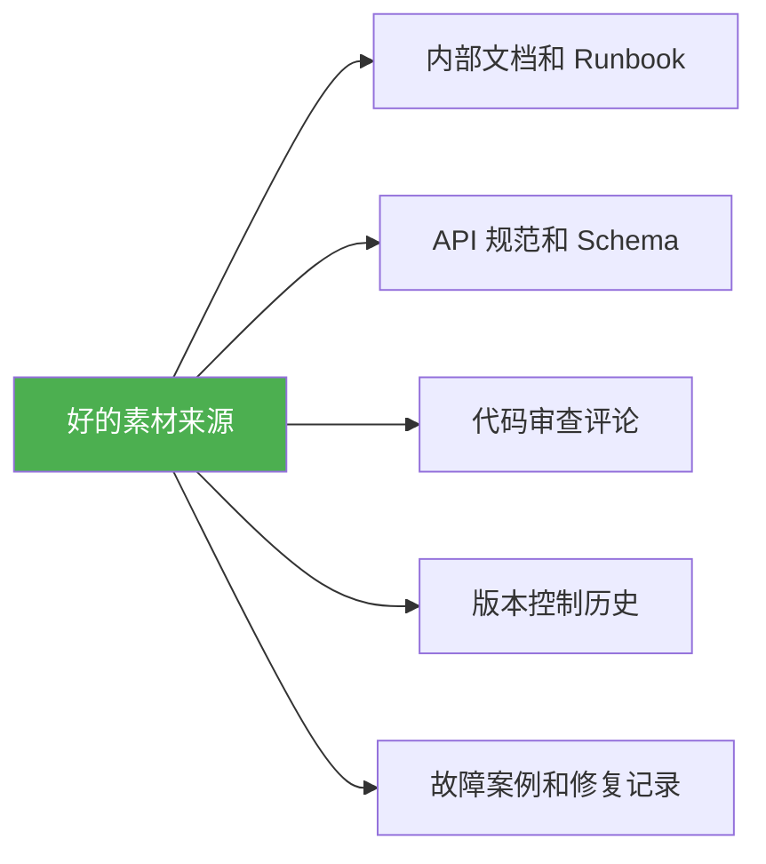
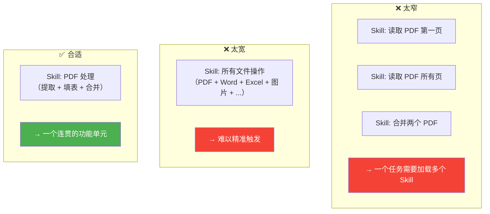
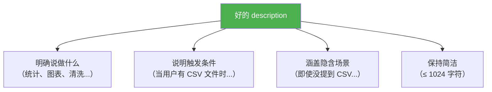

# 第七章：Skill 创建最佳实践

> 本章总结 Skill 创建的最佳实践，帮助你写出高质量、易维护、效果好的 Skill。

## 7.1 从真实经验出发

### ❌ 常见误区

很多人的第一反应是让 AI 直接生成一个 Skill，但这通常效果不好：

```markdown
# ❌ 让 AI 凭空生成的 Skill 往往很空洞
## 错误处理
Handle errors appropriately.   ← 太笼统，没有实际价值

## 认证
Follow best practices for authentication.  ← AI 什么都没说
```

### ✅ 正确方法

**方法一：从实际工作中提取**

1. 在与 AI Agent 协作完成某个真实任务时，记录以下内容：
   - ✅ 哪些步骤有效
   - 🔧 你做了哪些修正
   - 📋 输入/输出格式是什么
   - 💡 你提供了哪些 Agent 不知道的上下文

2. 将这些经验提炼成 Skill

**方法二：从项目文档综合提炼**

好的素材来源：



> 💡 关键原则：**项目专属的素材 >> 通用的最佳实践文章**

## 7.2 通过实际执行来优化

第一版 Skill 几乎总是需要改进。正确的做法是：


**关注什么？**

- 🔍 Agent 是否在做无用功？→ 指令可能太模糊
- 🔍 Agent 是否忽略了某些指令？→ 指令可能太长或不够清晰
- 🔍 Agent 是否选错了方法？→ 需要更明确的默认选项

> 💡 **提示**：阅读 Agent 的执行日志（不只是最终输出），才能发现问题所在。

## 7.3 高效利用上下文

当 Skill 被激活时，它的全部内容都会占用 Agent 的上下文窗口。每一个 token 都在与对话历史和其他活跃 Skill 竞争注意力。

### 原则一：只添加 Agent 不知道的内容

````markdown
<!-- ❌ 太啰嗦——Agent 已经知道 PDF 是什么 -->
## 提取 PDF 文本

PDF（可移植文档格式）是一种常见的文件格式，包含文本、图像
和其他内容。要从 PDF 中提取文本，你需要使用一个库。
推荐使用 pdfplumber，因为它能处理大部分情况。

<!-- ✅ 简洁——直接告诉 Agent 它不知道的 -->
## 提取 PDF 文本

使用 pdfplumber 提取文本。对于扫描件，改用 pdf2image + pytesseract。

```python
import pdfplumber

with pdfplumber.open("file.pdf") as pdf:
    text = pdf.pages[0].extract_text()
```
````

### 原则二：设计合理的粒度



### 原则三：大内容使用渐进式披露

```markdown
# SKILL.md（核心指令，< 500 行）

## 工作流程
1. 分析表单
2. 填写字段
3. 验证结果

## 详细参考
- 如果 API 返回非 200 状态码，请阅读 `references/api-errors.md`
- 完整的字段映射规则请参考 `references/field-mapping.md`
```

## 7.4 控制的精细度

不同的任务需要不同程度的控制：

### 灵活的指令（Agent 有自由度）

```markdown
## 代码审查流程

1. 检查数据库查询是否存在 SQL 注入（使用参数化查询）
2. 验证每个 API 端点的认证检查
3. 查找并发代码中的竞态条件
4. 确认错误消息不泄露内部细节
```

### 严格的指令（必须精确执行）

````markdown
## 数据库迁移

严格按以下命令执行：

```bash
python scripts/migrate.py --verify --backup
```

不要修改命令或添加额外参数。
````

### 提供默认方案，而非菜单

````markdown
<!-- ❌ 太多选择——Agent 不知道该用哪个 -->
你可以使用 pypdf、pdfplumber、PyMuPDF 或 pdf2image...

<!-- ✅ 明确的默认方案 + 备用方案 -->
使用 pdfplumber 提取文本：

```python
import pdfplumber
```

对于需要 OCR 的扫描 PDF，改用 pdf2image + pytesseract。
````

## 7.5 实用的内容模式

### 模式一："注意事项"（Gotchas）

这往往是 Skill 中**价值最高**的部分——记录那些 Agent 不可能知道的项目特定事实：

````markdown
## 注意事项

- `users` 表使用软删除。查询时必须加 `WHERE deleted_at IS NULL`，
  否则结果会包含已停用的账户。
- 用户 ID 在数据库中是 `user_id`，在认证服务中是 `uid`，
  在计费 API 中是 `accountId`——三者指同一个值。
- `/health` 端点只要 Web 服务器在运行就返回 200，即使数据库
  连接已断开。要检查完整的服务健康状态，请使用 `/ready`。
````

> 💡 **提示**：每当 Agent 犯了你需要纠正的错误，就把这个纠正加到注意事项中。

### 模式二：输出模板

当需要特定格式的输出时，提供模板比文字描述更有效：

````markdown
## 报告结构

使用此模板，根据具体分析调整各节内容：

```markdown
# [分析标题]

## 摘要
[一段话概述关键发现]

## 主要发现
- 发现 1（附支持数据）
- 发现 2（附支持数据）

## 建议
1. 具体可操作的建议
2. 具体可操作的建议
```
````

### 模式三：检查清单

帮助 Agent 跟踪多步骤工作流的进度：

```markdown
## 表单处理流程

进度清单：
- [ ] 步骤 1：分析表单（运行 `scripts/analyze_form.py`）
- [ ] 步骤 2：创建字段映射（编辑 `fields.json`）
- [ ] 步骤 3：验证映射（运行 `scripts/validate_fields.py`）
- [ ] 步骤 4：填写表单（运行 `scripts/fill_form.py`）
- [ ] 步骤 5：验证输出（运行 `scripts/verify_output.py`）
```

### 模式四：自我验证循环

让 Agent 在继续下一步之前验证自己的工作：

````markdown
## 编辑工作流

1. 进行编辑
2. 运行验证：`python scripts/validate.py output/`
3. 如果验证失败：
   - 查看错误消息
   - 修复问题
   - 再次运行验证
4. 只有在验证通过后才继续下一步
````

### 模式五：先计划再执行

对于批量或破坏性操作特别有用：

```markdown
## PDF 表单填写

1. 提取表单字段：`python scripts/analyze_form.py input.pdf` → `form_fields.json`
2. 创建 `field_values.json`，将每个字段名映射到目标值
3. 验证：`python scripts/validate_fields.py form_fields.json field_values.json`
4. 如果验证失败，修改 `field_values.json` 并重新验证
5. 填写表单：`python scripts/fill_form.py input.pdf field_values.json output.pdf`
```

## 7.6 编写好的 description

`description` 决定了 Skill 何时被触发，是成功的关键：

```yaml
# ❌ 差的描述
description: Process CSV files.

# ✅ 好的描述
description: >
  Analyze CSV and tabular data files — compute summary statistics,
  add derived columns, generate charts, and clean messy data. Use this
  skill when the user has a CSV, TSV, or Excel file and wants to
  explore, transform, or visualize the data, even if they don't
  explicitly mention "CSV" or "analysis."
```

### 描述优化要点



## 7.7 最佳实践清单

```markdown
## 创建 Skill 时的检查清单

### 内容质量
- [ ] 基于真实经验或项目文档，而非泛泛而谈
- [ ] 经过实际执行测试和迭代改进
- [ ] 只包含 Agent 不知道的信息
- [ ] SKILL.md 不超过 500 行

### 结构设计
- [ ] 粒度合适——既不太宽也不太窄
- [ ] 详细内容拆分到 references/ 目录
- [ ] 文件引用使用相对路径

### 指令质量
- [ ] 灵活任务给自由度，脆弱操作给精确指令
- [ ] 提供默认方案而非选择菜单
- [ ] 包含"注意事项"部分
- [ ] 多步骤使用检查清单或验证循环

### 元数据
- [ ] name 符合 kebab-case 规则
- [ ] name 与目录名匹配
- [ ] description 明确描述做什么和何时用
- [ ] 使用 skills-ref validate 通过验证
```

## 7.8 本章小结

| 最佳实践 | 要点 |
|----------|------|
| 从真实经验出发 | 不要让 AI 凭空生成，要用真实项目知识 |
| 迭代改进 | 测试 → 观察 → 修改 → 再测试 |
| 高效利用上下文 | 只写 Agent 不知道的，保持简洁 |
| 控制精细度 | 灵活任务给自由，脆弱操作给精确指令 |
| 实用模式 | 注意事项、模板、检查清单、验证循环 |
| 好的描述 | 明确做什么 + 何时触发 + 隐含场景 |

---

> ➡️ 下一章：[客户端集成指南](./08-client-implementation.md) — 了解如何让你的 AI Agent 支持 Agent Skills。
