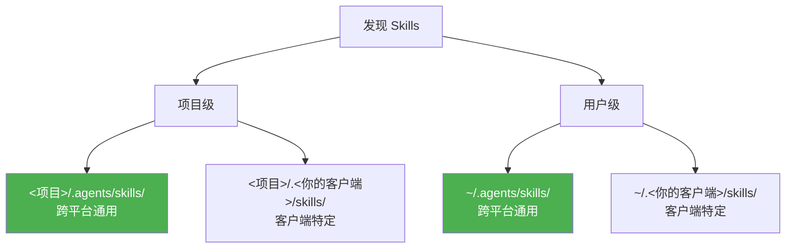
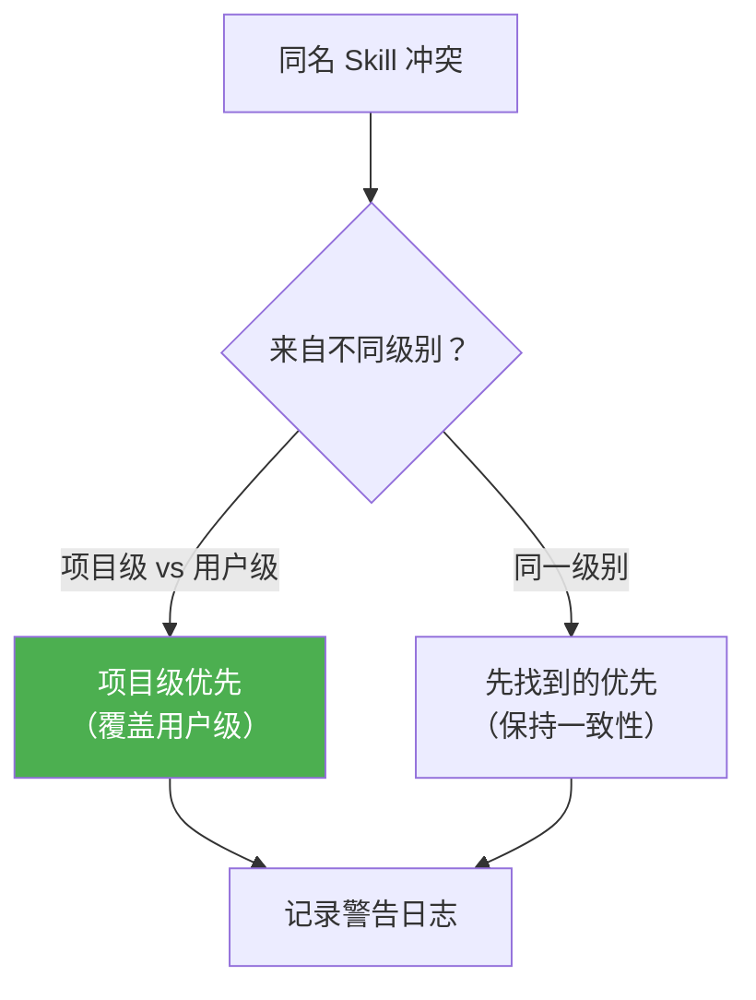
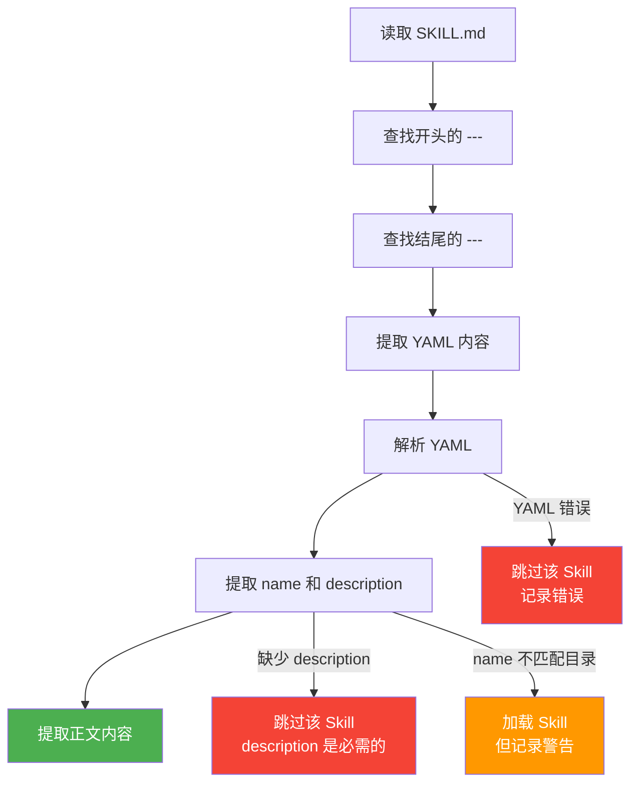
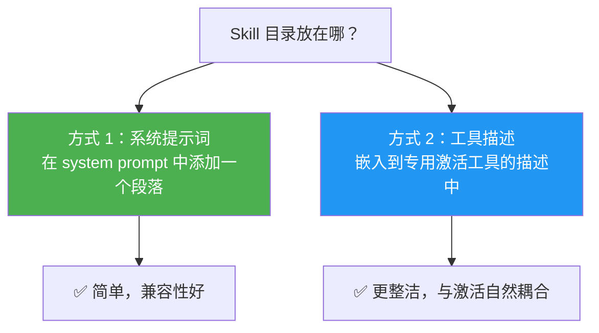
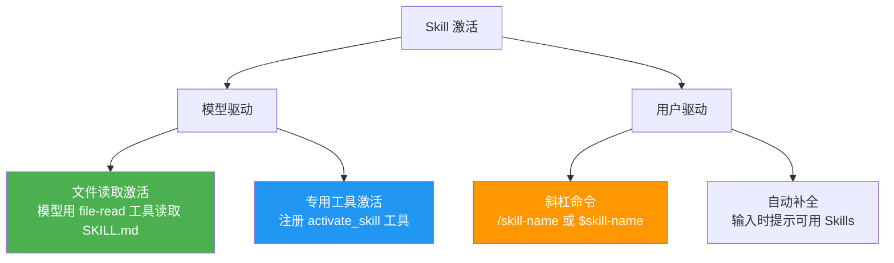
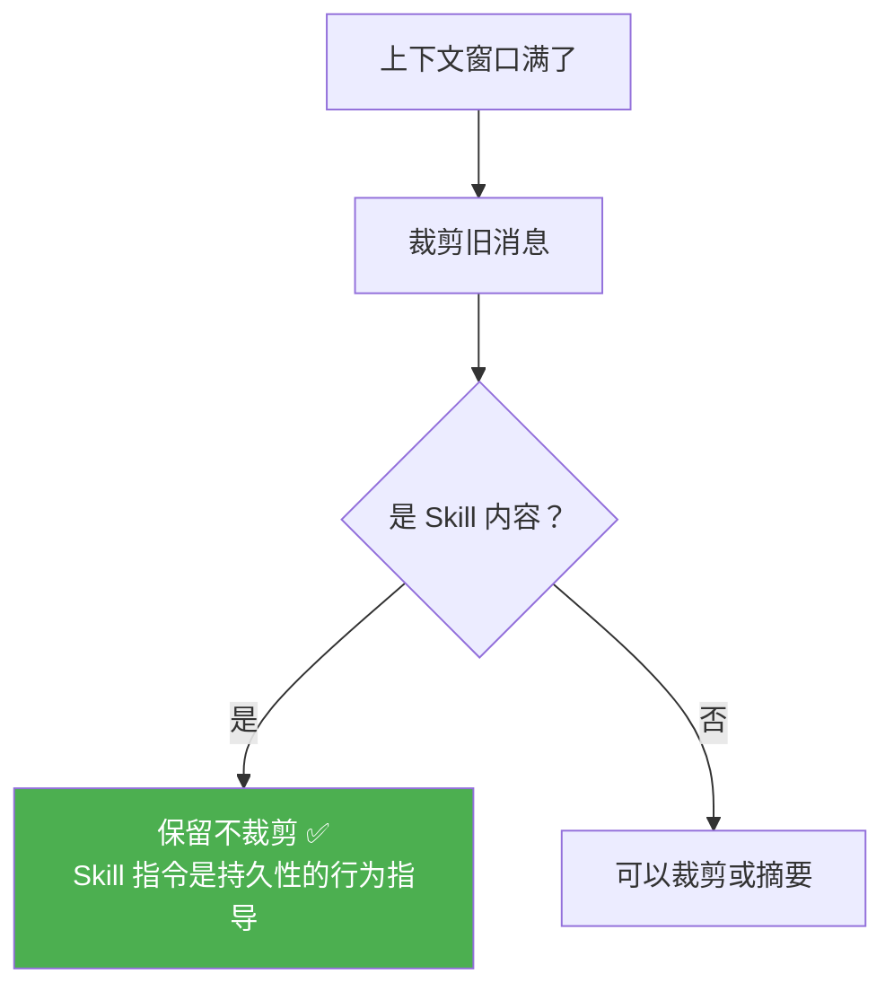
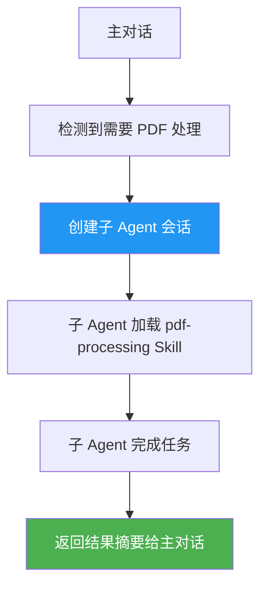

# 第八章：客户端集成指南

> 本章讲解如何让你的 AI Agent 或开发工具支持 Agent Skills 格式，覆盖从发现到执行的完整生命周期。

## 8.1 集成概览

将 Agent Skills 集成到你的 AI Agent 中，需要实现以下五个步骤：


整个过程的本质就是**渐进式披露**：

| 阶段 | 加载什么 | 时机 | Token 开销 |
|------|----------|------|------------|
| 目录 | name + description | 会话启动 | ~50-100/skill |
| 指令 | 完整 SKILL.md 正文 | Skill 被激活时 | < 5000 |
| 资源 | 脚本、参考文档等 | 指令引用时 | 视大小 |

## 8.2 步骤 1：发现 Skills

### 扫描位置



`.agents/skills/` 是社区广泛采用的**跨平台通用目录**，建议你的客户端至少扫描这个位置。

### 扫描规则

```python
# 伪代码：Skill 发现
def discover_skills(project_dir, home_dir, client_name):
    skills = {}
    
    # 扫描路径列表（优先级从低到高）
    scan_paths = [
        home_dir / ".agents/skills",          # 用户级通用
        home_dir / f".{client_name}/skills",  # 用户级特定
        project_dir / ".agents/skills",       # 项目级通用
        project_dir / f".{client_name}/skills", # 项目级特定
    ]
    
    for base_dir in scan_paths:
        if not base_dir.exists():
            continue
        for child in base_dir.iterdir():
            if child.is_dir():
                skill_md = child / "SKILL.md"
                if skill_md.exists():
                    props = parse_frontmatter(skill_md)
                    skills[props["name"]] = {
                        "name": props["name"],
                        "description": props["description"],
                        "location": str(skill_md),
                    }
    
    return skills
```

### 处理名称冲突



### 安全考虑

```
⚠️ 信任问题

项目级 Skills 来自仓库代码，可能不受信任（如刚克隆的开源项目）。
建议：只在用户将项目标记为"受信任"后，才加载项目级 Skills。
```

### 云端/沙箱环境

| 场景 | 解决方案 |
|------|----------|
| 项目级 Skills | 通常可从克隆的仓库中扫描 |
| 用户级 Skills | 需要外部来源：配置仓库、API 或上传 |
| 内置 Skills | 打包为静态资源，随 Agent 部署 |

## 8.3 步骤 2：解析 SKILL.md

### 解析流程



### 宽容验证

建议采用**宽容策略**——对不影响功能的问题发出警告但仍加载 Skill：

| 问题 | 处理方式 |
|------|----------|
| name 不匹配目录名 | ⚠️ 警告，但仍加载 |
| name 超过 64 字符 | ⚠️ 警告，但仍加载 |
| 缺少 description | ❌ 跳过（description 是触发的基础） |
| YAML 完全无法解析 | ❌ 跳过，记录错误 |

### 处理常见 YAML 问题

```yaml
# 常见问题：未转义的冒号
description: Use this skill when: the user asks about PDFs
#                              ^ 冒号会导致 YAML 解析失败

# 解决：自动用引号包裹或转换为块标量
description: "Use this skill when: the user asks about PDFs"
```

### 存储什么

每个发现的 Skill 至少需要存储：

```python
skill_record = {
    "name": "pdf-processing",            # 来自 frontmatter
    "description": "Extract PDF text...", # 来自 frontmatter
    "location": "/abs/path/to/SKILL.md",  # 文件绝对路径
}
```

## 8.4 步骤 3：披露给模型

把发现的 Skills 告诉模型，但不加载完整内容。

### 构建 Skill 目录

推荐的 XML 格式（Anthropic 模型推荐）：

```xml
<available_skills>
  <skill>
    <name>pdf-processing</name>
    <description>Extract PDF text, fill forms, merge files.</description>
    <location>/home/user/.agents/skills/pdf-processing/SKILL.md</location>
  </skill>
  <skill>
    <name>data-analysis</name>
    <description>Analyze datasets, generate charts.</description>
    <location>/home/user/project/.agents/skills/data-analysis/SKILL.md</location>
  </skill>
</available_skills>
```

也可以用 JSON 或其他格式，取决于你的模型偏好。

### 放置位置



### 行为指令

在目录旁边添加一段简短的使用说明：

```
以下 Skills 提供特定任务的专业指令。
当任务与某个 Skill 的描述匹配时，使用文件读取工具
加载对应位置的 SKILL.md，然后按照其中的指令操作。
引用相对路径时，以 SKILL.md 所在目录为基准。
```

### 过滤和特殊情况

- **被禁用的 Skills**：从目录中完全移除（不要列出但阻止访问）
- **无可用 Skills**：完全省略目录和行为指令

## 8.5 步骤 4：激活 Skills

当模型或用户选择了一个 Skill，将完整指令注入对话上下文。

### 激活方式



**文件读取激活**：最简单的方式，模型直接用已有的文件读取能力读取 SKILL.md：

```
模型思考：用户需要处理 PDF，匹配 pdf-processing Skill
模型操作：读取 /home/user/.agents/skills/pdf-processing/SKILL.md
结果：获得完整的 Skill 指令
```

**专用工具激活**：注册一个 `activate_skill` 工具：

```json
{
  "name": "activate_skill",
  "description": "Load a skill's full instructions",
  "parameters": {
    "name": {
      "type": "string",
      "enum": ["pdf-processing", "data-analysis"]
    }
  }
}
```

### 模型接收什么

两种方式都可以：

| 方式 | 说明 |
|------|------|
| **完整文件** | 包含 YAML frontmatter + Markdown 正文 |
| **仅正文** | 去掉 frontmatter，只给 Markdown 指令 |

### 结构化包装

使用专用工具时，建议用标签包装 Skill 内容：

```xml
<skill_content name="pdf-processing">
# PDF Processing

## When to use this skill
Use this skill when the user needs to work with PDF files...

Skill directory: /home/user/.agents/skills/pdf-processing
Relative paths in this skill are relative to the skill directory.

<skill_resources>
  <file>scripts/extract.py</file>
  <file>references/pdf-spec-summary.md</file>
</skill_resources>
</skill_content>
```

好处：
- 模型能区分 Skill 指令和对话内容
- 便于上下文管理时识别 Skill 内容
- 展示可用资源但不立即加载

## 8.6 步骤 5：管理上下文

Skill 内容进入上下文后，需要维护其有效性。

### 保护 Skill 内容不被裁剪



**为什么这很重要？** 如果 Skill 指令在对话中途被裁剪，Agent 会在没有任何错误提示的情况下失去专业能力。

### 去重激活

```python
# 记录已激活的 Skills
activated_skills = set()

def activate_skill(name):
    if name in activated_skills:
        return "Skill already loaded."  # 跳过重复加载
    
    content = load_skill_content(name)
    activated_skills.add(name)
    return content
```

### 子 Agent 委派（高级）



优点：
- 主对话不被 Skill 内容污染
- 子 Agent 有干净的、专注的上下文
- 适合复杂的多步骤工作流

## 8.7 完整集成伪代码

```python
class SkillsClient:
    def __init__(self, project_dir, home_dir, client_name):
        self.catalog = {}
        self.activated = set()
        
        # 步骤 1：发现
        self._discover(project_dir, home_dir, client_name)
    
    def _discover(self, project_dir, home_dir, client_name):
        """扫描目录，构建 Skill 目录"""
        scan_paths = [
            home_dir / ".agents/skills",
            project_dir / ".agents/skills",
        ]
        for base in scan_paths:
            if not base.exists():
                continue
            for child in base.iterdir():
                skill_md = child / "SKILL.md"
                if skill_md.exists():
                    # 步骤 2：解析
                    try:
                        props = self._parse(skill_md)
                        self.catalog[props["name"]] = props
                    except Exception as e:
                        print(f"Warning: {e}")
    
    def _parse(self, skill_md):
        """解析 SKILL.md frontmatter"""
        content = skill_md.read_text()
        # ... 解析 YAML frontmatter ...
        return {"name": name, "description": desc, "location": str(skill_md)}
    
    def get_catalog_prompt(self):
        """步骤 3：生成目录提示词"""
        if not self.catalog:
            return ""
        
        lines = ["<available_skills>"]
        for skill in self.catalog.values():
            lines.append(f'  <skill>')
            lines.append(f'    <name>{skill["name"]}</name>')
            lines.append(f'    <description>{skill["description"]}</description>')
            lines.append(f'    <location>{skill["location"]}</location>')
            lines.append(f'  </skill>')
        lines.append("</available_skills>")
        return "\n".join(lines)
    
    def activate(self, name):
        """步骤 4：激活 Skill"""
        # 去重检查
        if name in self.activated:
            return None
        
        skill = self.catalog.get(name)
        if not skill:
            return None
        
        content = Path(skill["location"]).read_text()
        self.activated.add(name)
        return content
```

## 8.8 本章小结


| 步骤 | 关键点 |
|------|--------|
| 发现 | 扫描 `.agents/skills/`，项目级覆盖用户级 |
| 解析 | 宽容验证，缺少 description 才跳过 |
| 披露 | name + description 放入系统提示词或工具描述 |
| 激活 | 文件读取或专用工具，支持模型驱动和用户驱动 |
| 管理 | 保护 Skill 内容不被裁剪，去重激活 |

---

> ➡️ 下一章：[进阶主题](./09-advanced-topics.md) — Skill 评估、描述优化和脚本使用。
