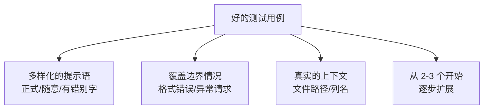
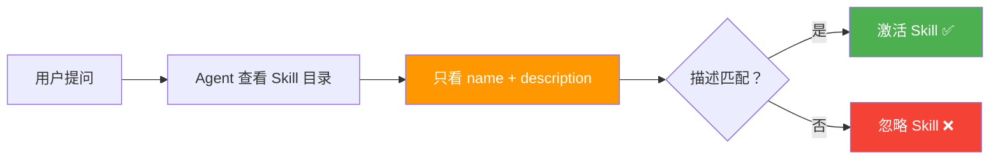
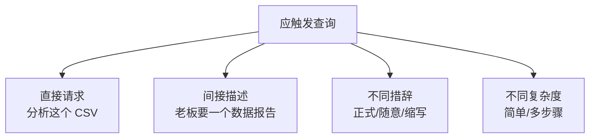
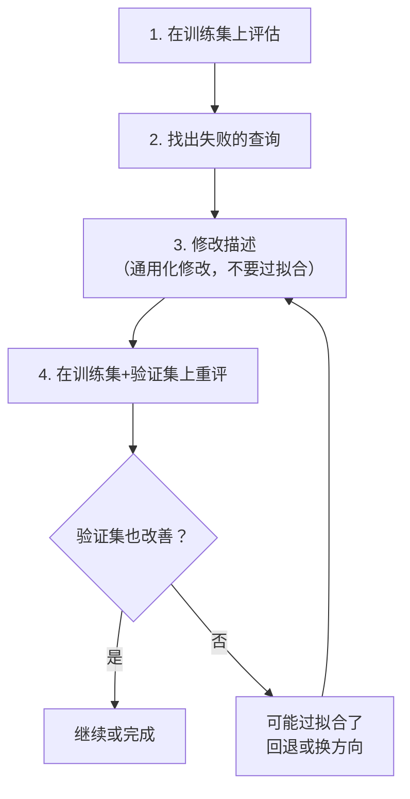
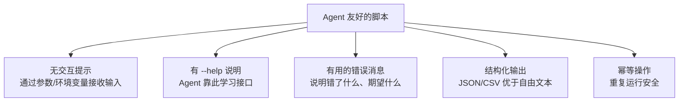
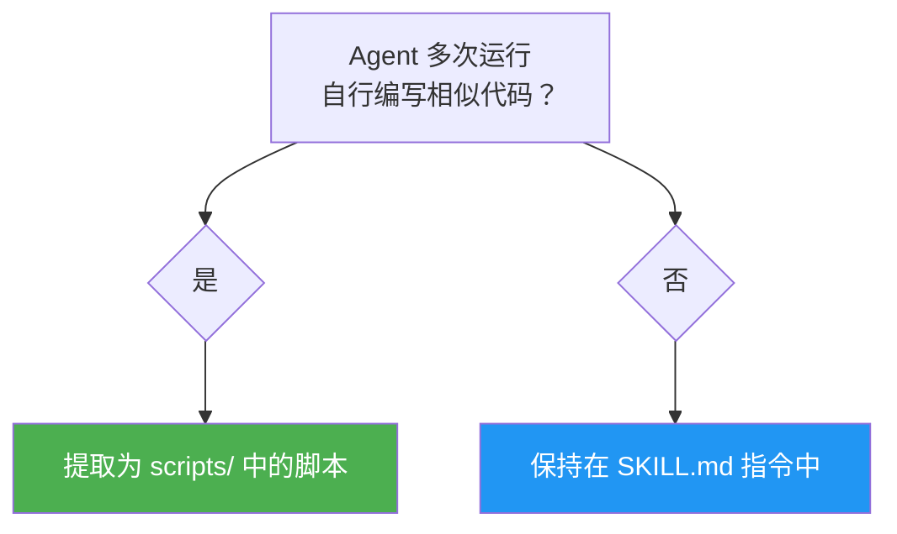
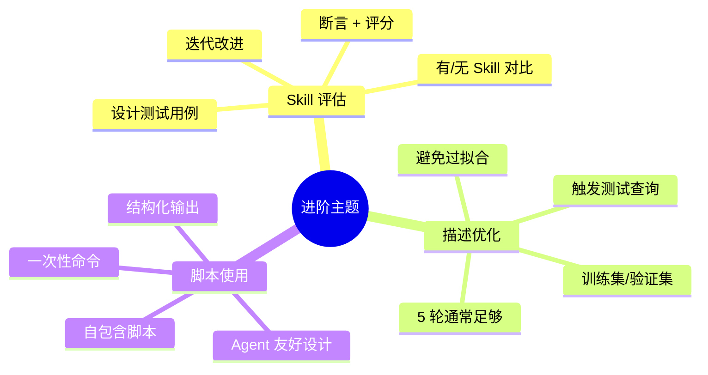

# 第九章：进阶主题

> 本章涵盖 Agent Skills 的高级话题，包括 Skill 评估方法、描述优化技巧和脚本使用指南。

## 9.1 Skill 评估（Evaluating Skills）

创建 Skill 后，如何知道它是否真的有效？不只是在一个示例上看起来可以，而是在各种情况下都表现良好？

### 评估的核心思路


### 设计测试用例

每个测试用例包含三部分：

```json
{
  "skill_name": "csv-analyzer",
  "evals": [
    {
      "id": 1,
      "prompt": "我有一个 CSV 文件 data/sales.csv，找出营收最高的 3 个月并画柱状图",
      "expected_output": "一张柱状图，显示营收最高的 3 个月",
      "files": ["evals/files/sales.csv"],
      "assertions": [
        "输出包含一个柱状图图片文件",
        "图表恰好显示 3 个月份",
        "两个轴都有标签",
        "标题或说明提到了营收"
      ]
    }
  ]
}
```

### 测试用例编写建议



### 评估工作流

```
csv-analyzer/              ← Skill 目录
├── SKILL.md
└── evals/
    └── evals.json         ← 测试用例定义

csv-analyzer-workspace/    ← 工作区（评估结果）
└── iteration-1/           ← 第一轮迭代
    ├── eval-top-months/
    │   ├── with_skill/    ← 有 Skill 的结果
    │   │   ├── outputs/
    │   │   ├── timing.json
    │   │   └── grading.json
    │   └── without_skill/ ← 无 Skill 的基线
    │       ├── outputs/
    │       ├── timing.json
    │       └── grading.json
    └── benchmark.json     ← 汇总统计
```

### 评分标准

对每个断言进行 PASS/FAIL 评分，要求**具体的证据**：

```json
{
  "assertion_results": [
    {
      "text": "输出包含柱状图文件",
      "passed": true,
      "evidence": "在 outputs/ 中找到 chart.png (45KB)"
    },
    {
      "text": "两个轴都有标签",
      "passed": false,
      "evidence": "Y 轴标注了'营收(元)'但 X 轴没有标签"
    }
  ],
  "summary": {
    "passed": 3,
    "failed": 1,
    "total": 4,
    "pass_rate": 0.75
  }
}
```

### 汇总对比

```json
{
  "run_summary": {
    "with_skill": {
      "pass_rate": { "mean": 0.83 },
      "tokens": { "mean": 3800 }
    },
    "without_skill": {
      "pass_rate": { "mean": 0.33 },
      "tokens": { "mean": 2100 }
    },
    "delta": {
      "pass_rate": 0.50,
      "tokens": 1700
    }
  }
}
```

这告诉我们：**Skill 将通过率从 33% 提升到了 83%，代价是多使用了 1700 个 tokens。**

### 迭代改进循环


改进信号来自三个方面：
1. **失败的断言** → 具体的缺失或错误
2. **人工反馈** → 质量和方法的改进方向
3. **执行日志** → 为什么 Agent 走了弯路

## 9.2 描述优化（Optimizing Descriptions）

### 为什么描述这么重要？



`description` 承担了**全部的触发责任**。描述写得不好，Skill 就不会被使用。

### 描述编写原则

1. **使用祈使句**："当...时使用此 Skill" 而非 "此 Skill 可以..."
2. **关注用户意图**：描述用户想做什么，而非 Skill 内部机制
3. **适当激进**：明确列出应该触发的场景
4. **保持简洁**：不超过 1024 字符

### 设计触发测试

创建测试查询集，标记每个查询是否应该触发你的 Skill：

```json
[
  {
    "query": "分析 ~/data/q4_results.xlsx 的营收数据",
    "should_trigger": true
  },
  {
    "query": "把这个 JSON 文件转成 YAML",
    "should_trigger": false
  }
]
```

**建议 20 个查询**：8-10 个应该触发 + 8-10 个不应该触发。

### 应该触发的查询类型



### 不应触发的查询类型

| 查询类型 | 好坏 | 原因 |
|----------|------|------|
| "写一个斐波那契函数" | ❌ 差 | 完全无关，测不出什么 |
| "用 Python 读取 CSV 并上传到数据库" | ✅ 好 | 有关键词重叠但任务不同（近似误区） |
| "更新 Excel 公式" | ✅ 好 | 共享概念但需要不同 Skill |

### 优化循环



**关键**：将查询分为训练集（60%）和验证集（40%），只用训练集指导修改，用验证集检测是否过拟合。

### 优化前后对比

```yaml
# 优化前
description: Process CSV files.

# 优化后
description: >
  Analyze CSV and tabular data files — compute summary statistics,
  add derived columns, generate charts, and clean messy data. Use 
  this skill when the user has a CSV, TSV, or Excel file and wants 
  to explore, transform, or visualize the data, even if they don't 
  explicitly mention "CSV" or "analysis."
```

改进点：
- ✅ 更具体的功能列表（统计、图表、清洗）
- ✅ 更广的文件类型（CSV、TSV、Excel）
- ✅ 覆盖隐含场景（即使没提到"CSV"）

## 9.3 使用脚本（Using Scripts）

### 一次性命令

不需要 `scripts/` 目录，直接在 SKILL.md 中引用已有工具：

```markdown
## 代码格式化

使用以下命令格式化代码：

```bash
# Python：使用 uvx 运行 ruff
uvx ruff@0.8.0 check .

# JavaScript：使用 npx 运行 eslint
npx eslint@9 --fix .

# Go：使用 go run
go run golang.org/x/tools/cmd/goimports@v0.28.0 .
```
```

**建议**：
- 📌 固定版本号（如 `eslint@9.0.0`）确保可重现
- 📝 声明前提条件（如"需要 Node.js 18+"）

### 自包含脚本

将脚本放在 `scripts/` 目录，内联声明依赖：

**Python（PEP 723）**：

```python
# scripts/extract.py
# /// script
# dependencies = [
#   "beautifulsoup4",
# ]
# ///

from bs4 import BeautifulSoup

html = '<html><body><h1>Welcome</h1></body></html>'
print(BeautifulSoup(html, "html.parser").get_text())
```

运行：

```bash
uv run scripts/extract.py
```

> `uv run` 会自动创建隔离环境、安装依赖、运行脚本，无需手动管理。

### 为 Agent 设计脚本的原则



### ❌ 错误示例 vs ✅ 正确示例

**交互式提示（Agent 会卡住）**：

```
$ python scripts/deploy.py
Target environment: _          ← Agent 无法输入！
```

**参数化输入（Agent 可以使用）**：

```
$ python scripts/deploy.py
Error: --env is required. Options: development, staging, production.
Usage: python scripts/deploy.py --env staging --tag v1.2.3
```

### 引用脚本

在 SKILL.md 中使用**相对路径**引用脚本：

````markdown
## 可用脚本

- **`scripts/validate.sh`** — 验证配置文件
- **`scripts/process.py`** — 处理输入数据

## 工作流程

1. 运行验证：
   ```bash
   bash scripts/validate.sh "$INPUT_FILE"
   ```

2. 处理数据：
   ```bash
   python3 scripts/process.py --input results.json
   ```
````

## 9.4 脚本设计进阶

### 输出设计

```
# ❌ 不好——难以解析
NAME          STATUS    CREATED
my-service    running   2025-01-15

# ✅ 好——结构化，易解析
{"name": "my-service", "status": "running", "created": "2025-01-15"}
```

### stdout vs stderr

```python
import sys
import json

# 数据输出到 stdout（Agent 可以解析）
print(json.dumps({"result": "success", "count": 42}))

# 进度信息输出到 stderr（不影响数据解析）
print("Processing 50%...", file=sys.stderr)
```

### 预控制大小输出

```
Agent 的上下文窗口有限（通常 10-30K 字符截断）。

建议：
- 默认输出摘要
- 支持 --offset 参数分页获取
- 大输出写入文件（--output file.json）
```

## 9.5 何时将逻辑提取为脚本



当你发现：
- Agent 在不同测试中**重复编写类似的代码**
- 某个操作需要**精确的参数和步骤**
- 操作涉及**外部依赖**需要管理

→ 就应该创建一个脚本放在 `scripts/` 目录。

## 9.6 本章小结



| 主题 | 核心要点 |
|------|----------|
| **Skill 评估** | 设计测试用例，对比有/无 Skill 的结果，迭代改进 |
| **描述优化** | 系统化测试触发率，避免过拟合，平衡精确和召回 |
| **脚本使用** | 无交互、有帮助信息、结构化输出、幂等安全 |

---

> 🎉 恭喜你完成了全部教程！回到 [教程首页](./README.md) 查看更多资源。
