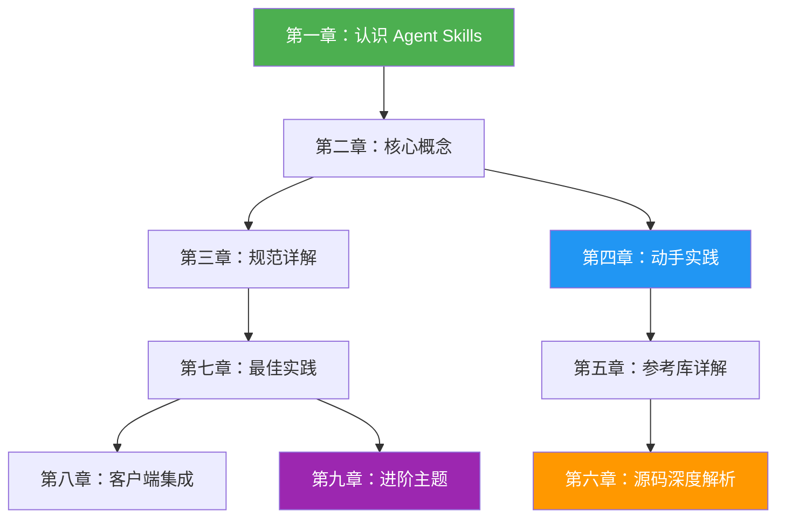

# Agent Skills 学习教程

> 📚 本教程旨在帮助你从零开始理解 [Agent Skills](https://agentskills.io) —— 一个为 AI Agent 赋予新能力的开放格式规范。

## 📖 教程目录

| 章节 | 标题 | 内容概述 |
|------|------|----------|
| [第一章](./01-introduction.md) | **认识 Agent Skills** | 什么是 Agent Skills？它解决了什么问题？整体架构一览 |
| [第二章](./02-core-concepts.md) | **核心概念** | 渐进式披露、SKILL.md 文件格式、目录结构等关键概念 |
| [第三章](./03-specification.md) | **规范详解** | Frontmatter 字段详细说明、命名规则、验证约束 |
| [第四章](./04-quickstart.md) | **动手实践：创建第一个 Skill** | 从零创建一个掷骰子 Skill，在 VS Code 中测试运行 |
| [第五章](./05-reference-library.md) | **Python 参考库详解** | skills-ref 库的安装、使用及 API 介绍 |
| [第六章](./06-source-code-analysis.md) | **源码深度解析** | 逐模块分析 Python 参考库的实现细节与设计模式 |
| [第七章](./07-best-practices.md) | **Skill 创建最佳实践** | 如何写出高质量、可维护的 Skill |
| [第八章](./08-client-implementation.md) | **客户端集成指南** | 如何让你的 AI Agent 支持 Agent Skills |
| [第九章](./09-advanced-topics.md) | **进阶主题** | Skill 评估、描述优化、脚本使用等高级话题 |

## 🗺️ 学习路径推荐



### 按角色推荐

- **🎯 快速入门**：第一章 → 第二章 → 第四章
- **📝 Skill 作者**：第一章 → 第二章 → 第三章 → 第四章 → 第七章 → 第九章
- **🔧 客户端开发者**：第一章 → 第二章 → 第三章 → 第五章 → 第六章 → 第八章
- **🔬 深度学习**：按顺序阅读全部章节

## 🏗️ 仓库结构概览

```
agentskills/
├── docs/                   # 官方文档站点（Mintlify 驱动）
│   ├── home.mdx            # 首页
│   ├── what-are-skills.mdx # 概念介绍
│   ├── specification.mdx   # 格式规范
│   ├── skill-creation/     # Skill 创建指南
│   └── client-implementation/  # 客户端集成指南
├── skills-ref/             # Python 参考库
│   ├── src/skills_ref/     # 源码
│   │   ├── models.py       # 数据模型
│   │   ├── parser.py       # YAML 解析器
│   │   ├── validator.py    # 验证器
│   │   ├── prompt.py       # 提示词生成
│   │   └── cli.py          # 命令行工具
│   └── tests/              # 测试套件
├── learn/                  # 📚 本教程目录（你在这里）
├── README.md               # 项目说明
├── CONTRIBUTING.md          # 贡献指南
└── LICENSE                  # Apache 2.0 许可证
```

## ⚡ 前置知识

阅读本教程，你最好了解以下内容（但不是必须的）：

- **Markdown** 基本语法
- **YAML** 基本格式
- **Python** 基础知识（用于理解参考库部分）
- 对 **AI Agent**（如 GitHub Copilot、Claude Code）有基本了解

## 📝 关于本教程

- **语言**：中文（简体）
- **格式**：Markdown
- **图表**：使用 Mermaid 绘制
- **代码**：附带可运行的示例代码
- **来源**：基于 [agentskills/agentskills](https://github.com/agentskills/agentskills) 仓库内容编写

---

> 💡 **提示**：建议按照推荐的学习路径阅读，也可以根据自身需求跳转到感兴趣的章节。每个章节都是相对独立的，可以单独阅读。
